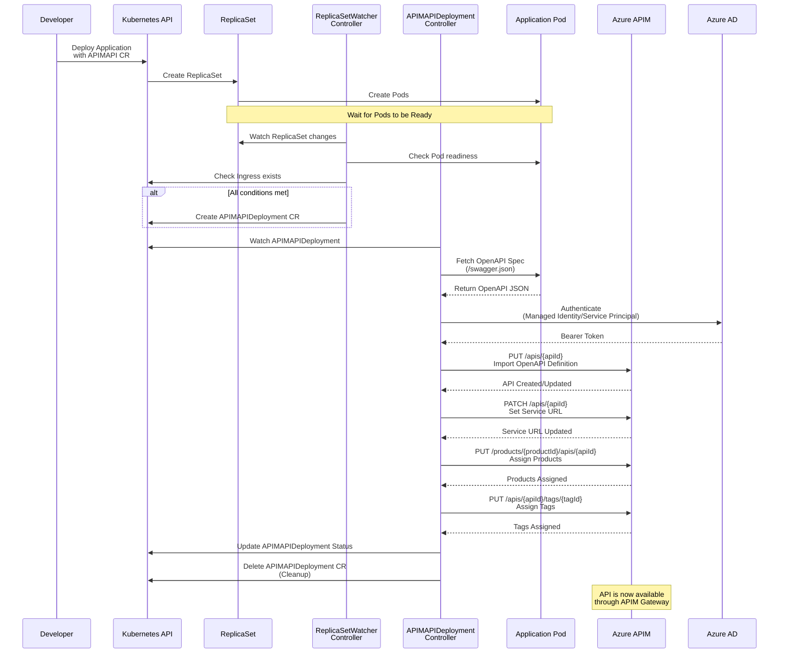
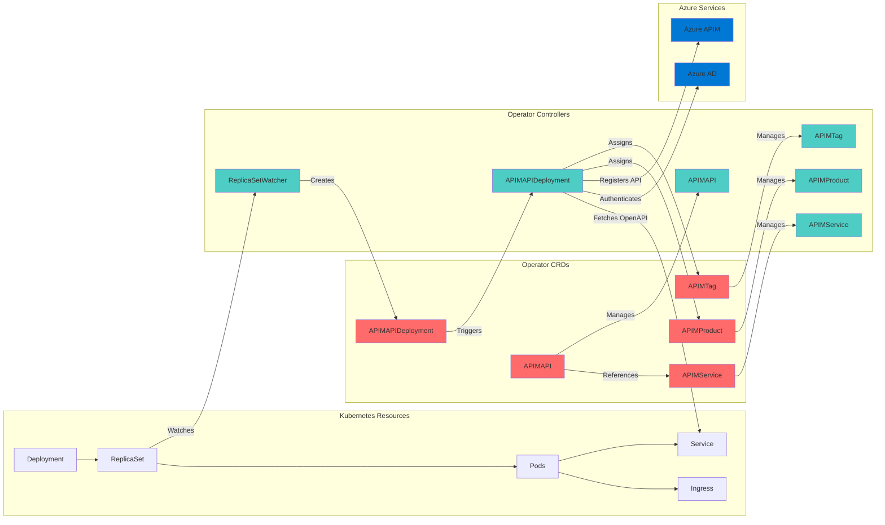
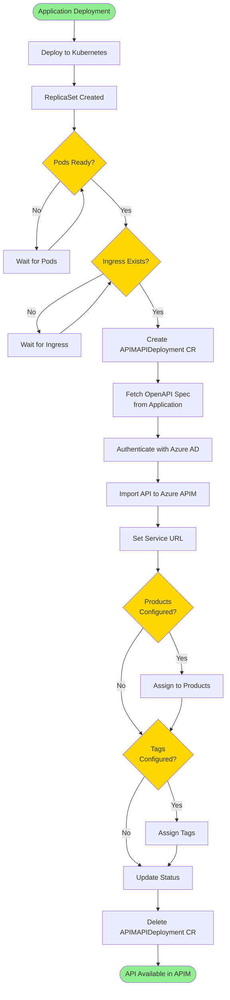

# Azure APIM Operator for Kubernetes

<div align="center">


**Seamlessly deploy and manage APIs in Azure API Management directly from Kubernetes**

[Features](#-features) • [Quick Start](#-quick-start) • [Architecture](#-architecture) • [Documentation](#-documentation)

</div>

---

## 📋 Overview

The **Azure APIM Operator** is a Kubernetes operator built with **Kubebuilder** and **Go** that automates the registration and management of APIs in Azure API Management (APIM). It provides a declarative, GitOps-friendly way to manage your API lifecycle by leveraging Kubernetes Custom Resource Definitions (CRDs).

### Key Benefits

- ✅ **Automated API Registration** - APIs are automatically registered in Azure APIM when deployed to Kubernetes
- ✅ **OpenAPI Integration** - Automatically fetches and imports OpenAPI/Swagger specifications
- ✅ **Declarative Management** - Manage APIs, Products, and Tags using Kubernetes resources
- ✅ **GitOps Ready** - Works seamlessly with GitOps workflows and CI/CD pipelines
- ✅ **Production Ready** - Built with enterprise-grade features including RBAC, metrics, and health checks

---

## 📌 Features

- **Automatic API Registration** - Detects new deployments and automatically registers them in Azure APIM
- **OpenAPI/Swagger Integration** - Fetches OpenAPI definitions from your deployed services
- **Product Management** - Automatically assigns APIs to APIM Products
- **Tag Management** - Organize APIs with tags for better categorization
- **Service URL Updates** - Automatically updates backend service URLs in APIM
- **Revision Support** - Manages API revisions in Azure APIM
- **Azure Workload Identity** - Secure authentication using Azure Workload Identity
- **Helm Deployment** - Easy installation and lifecycle management via Helm charts
- **Multi-Namespace Support** - Deploy APIs across multiple Kubernetes namespaces
- **Observability** - Built-in metrics, health checks, and structured logging

---

## 📚 Prerequisites

### Required Tools

- **Kubernetes** cluster (1.21+) - AKS, EKS, GKE, or any compatible distribution
- **kubectl** - Configured to access your cluster
- **Helm** (3.8+) - For operator installation
- **Azure CLI** - For Azure resource management (optional)

### Azure Requirements

- **Azure Subscription** with an Azure API Management instance
- **Azure Workload Identity** configured (or Service Principal credentials)
- **RBAC Permissions** - The identity needs permissions to manage APIM resources:
  - `Microsoft.ApiManagement/service/apis/*`
  - `Microsoft.ApiManagement/service/products/*`
  - `Microsoft.ApiManagement/service/tags/*`

### Development Tools (for building from source)

- **Go** (1.21+)
- **Kubebuilder** (`go install sigs.k8s.io/kubebuilder/...`)
- **Docker** - For building container images

---

## 🚀 Quick Start

### Step 1: Install the Operator

Deploy the operator using Helm:

```bash
helm upgrade --install azure-apim-operator ./charts/azure-apim-operator \
  --namespace apim-operator \
  --create-namespace
```

### Step 2: Configure Azure APIM Service

Create an `APIMService` resource to define your Azure APIM instance:

```yaml
apiVersion: apim.operator.io/v1
kind: APIMService
metadata:
  name: my-apim-instance
  namespace: apim-operator
spec:
  name: my-apim-service
  resourceGroup: my-resource-group
  subscription: <your-azure-subscription-id>
```

### Step 3: Configure Authentication

Set up Azure Workload Identity by configuring environment variables in the operator deployment:

```yaml
env:
  - name: AZURE_CLIENT_ID
    value: "<your-managed-identity-client-id>"
  - name: AZURE_TENANT_ID
    value: "<your-azure-tenant-id>"
```

Or use a Service Account with Workload Identity annotations:

```yaml
apiVersion: v1
kind: ServiceAccount
metadata:
  name: azure-apim-operator
  namespace: apim-operator
  annotations:
    azure.workload.identity/client-id: "<your-managed-identity-client-id>"
```

### Step 4: Register Your First API

Create an `APIMAPI` resource for your application:

```yaml
apiVersion: apim.operator.io/v1
kind: APIMAPI
metadata:
  name: my-api
  namespace: default
spec:
  APIID: my-api
  serviceUrl: https://my-api.example.com
  routePrefix: /api/v1
  openApiDefinitionUrl: https://my-api.example.com/swagger/v1/swagger.json
  apimService: my-apim-instance
  productIds:
    - my-product
  tagIds:
    - backend
    - v1
```

Apply the configuration:

```bash
kubectl apply -f my-api.yaml
```

### Step 5: Deploy Your Application

Deploy your application with the correct labels:

```yaml
apiVersion: apps/v1
kind: Deployment
metadata:
  name: my-api
  labels:
    app.kubernetes.io/name: my-api
spec:
  replicas: 2
  selector:
    matchLabels:
      app.kubernetes.io/name: my-api
  template:
    metadata:
      labels:
        app.kubernetes.io/name: my-api
    spec:
      containers:
      - name: api
        image: my-api:latest
        ports:
        - containerPort: 8080
---
apiVersion: networking.k8s.io/v1
kind: Ingress
metadata:
  name: my-api
spec:
  rules:
  - host: my-api.example.com
    http:
      paths:
      - path: /
        pathType: Prefix
        backend:
          service:
            name: my-api
            port:
              number: 80
```

The operator will automatically:
1. Detect the ReplicaSet when pods are ready
2. Verify the Ingress exists
3. Create an `APIMAPIDeployment` resource
4. Fetch the OpenAPI specification
5. Register the API in Azure APIM
6. Assign products and tags
7. Clean up intermediate resources

### Step 6: Verify Installation

Check that CRDs are installed:

```bash
kubectl get crds | grep apim.operator.io
```

Check operator status:

```bash
kubectl get pods -n apim-operator
kubectl logs -l app.kubernetes.io/name=azure-apim-operator -n apim-operator
```

Check API registration status:

```bash
kubectl get apimapi -A
kubectl describe apimapi my-api
```

---

## 🏗️ Architecture

### System Architecture

The operator consists of multiple controllers that work together to automate API management:

```mermaid
graph TB
    subgraph K8s["Kubernetes Cluster"]
        subgraph AppNS["Application Namespace"]
            RS[ReplicaSet<br/>app.kubernetes.io/name: my-api]
            Pod1[Pod 1<br/>Ready]
            Pod2[Pod 2<br/>Ready]
            Ingress[Ingress<br/>example.com]
            APIMAPI[APIMAPI CR<br/>Defines API config]
            
            RS --> Pod1
            RS --> Pod2
            Pod1 --> Ingress
            Pod2 --> Ingress
        end
        
        subgraph OperatorNS["apim-operator Namespace"]
            Operator[Azure APIM Operator<br/>Controller Manager]
            APIMService[APIMService CR<br/>Azure APIM Instance Config]
        end
        
        subgraph CRDs["Custom Resources"]
            APIMAPIDeploy[APIMAPIDeployment CR<br/>Intermediate Resource]
            APIMProduct[APIMProduct CR]
            APIMTag[APIMTag CR]
        end
    end
    
    subgraph Azure["Azure Cloud"]
        APIM[Azure API Management<br/>Service Instance]
        AAD[Azure Active Directory<br/>Authentication]
    end
    
    subgraph Controllers["Operator Controllers"]
        RSWatcher[ReplicaSetWatcher<br/>Controller]
        DeployController[APIMAPIDeployment<br/>Controller]
        APIController[APIMAPI<br/>Controller]
        ServiceController[APIMService<br/>Controller]
        ProductController[APIMProduct<br/>Controller]
        TagController[APIMTag<br/>Controller]
    end
    
    %% Watch Flow
    RS -.watches.-> RSWatcher
    RSWatcher -.checks.-> Pod1
    RSWatcher -.checks.-> Pod2
    RSWatcher -.checks.-> Ingress
    RSWatcher -.reads.-> APIMAPI
    RSWatcher -.reads.-> APIMService
    
    %% Creation Flow
    RSWatcher -.creates.-> APIMAPIDeploy
    
    %% Deployment Flow
    APIMAPIDeploy -.watches.-> DeployController
    DeployController -.fetches.-> Ingress
    DeployController -.fetches.-> OpenAPI[OpenAPI Spec<br/>/swagger.json]
    DeployController -.authenticates.-> AAD
    DeployController -.registers.-> APIM
    
    %% Configuration Flow
    APIMAPI -.managed by.-> APIController
    APIMService -.managed by.-> ServiceController
    APIMProduct -.managed by.-> ProductController
    APIMTag -.managed by.-> TagController
    
    %% Azure Integration
    AAD -.provides token.-> DeployController
    DeployController -.API Management REST API.-> APIM
    
    %% Styling
    classDef k8sResource fill:#326ce5,stroke:#fff,color:#fff
    classDef crd fill:#ff6b6b,stroke:#fff,color:#fff
    classDef controller fill:#4ecdc4,stroke:#fff,color:#fff
    classDef azure fill:#0078d4,stroke:#fff,color:#fff
    classDef operator fill:#ffa500,stroke:#fff,color:#fff
    
    class RS,Pod1,Pod2,Ingress k8sResource
    class APIMAPI,APIMAPIDeploy,APIMService,APIMProduct,APIMTag crd
    class RSWatcher,DeployController,APIController,ServiceController,ProductController,TagController controller
    class APIM,AAD azure
    class Operator operator
```



### Workflow Sequence

The following diagram illustrates the complete workflow from application deployment to API registration:



### Component Interaction



### Data Flow



---

## 🔄 How It Works

### Controller Architecture

The operator consists of several specialized controllers:

#### 1. **ReplicaSet Watcher Controller**

- **Purpose**: Monitors Kubernetes ReplicaSets and triggers API registration
- **Behavior**:
  - Watches for ReplicaSet changes
  - Matches ReplicaSets to `APIMAPI` resources using `app.kubernetes.io/name` labels
  - Verifies that:
    - Pods are ready and running
    - Ingress resource exists
  - Creates an intermediate `APIMAPIDeployment` CR when all conditions are met

#### 2. **APIMAPIDeployment Controller**

- **Purpose**: Handles the actual API registration in Azure APIM
- **Behavior**:
  - Watches for `APIMAPIDeployment` resources
  - Fetches OpenAPI/Swagger specification from the application endpoint
  - Authenticates with Azure AD using Workload Identity
  - Registers or updates the API in Azure APIM via Azure Management API
  - Updates service URLs to point to the Kubernetes service
  - Assigns products and tags if configured
  - Cleans up the intermediate CR after successful deployment

#### 3. **APIMAPI Controller**

- **Purpose**: Manages the lifecycle of `APIMAPI` resources
- **Behavior**: Handles updates and status tracking

#### 4. **APIMService Controller**

- **Purpose**: Manages Azure APIM service configuration
- **Behavior**: Retrieves and stores APIM service details (hostnames, etc.)

#### 5. **APIMProduct Controller**

- **Purpose**: Creates and manages APIM Products
- **Behavior**: Synchronizes Product definitions with Azure APIM

#### 6. **APIMTag Controller**

- **Purpose**: Creates and manages APIM Tags
- **Behavior**: Synchronizes Tag definitions with Azure APIM

---

## 📝 Custom Resources

### APIMService

Defines an Azure API Management service instance:

```yaml
apiVersion: apim.operator.io/v1
kind: APIMService
metadata:
  name: my-apim-service
  namespace: apim-operator
spec:
  name: my-apim-service-name          # APIM service name in Azure
  resourceGroup: my-resource-group    # Azure resource group
  subscription: <subscription-id>     # Azure subscription ID
```

### APIMAPI

Defines an API to be registered in Azure APIM:

```yaml
apiVersion: apim.operator.io/v1
kind: APIMAPI
metadata:
  name: my-api
  namespace: default
spec:
  APIID: my-api                       # Unique API identifier in APIM
  serviceUrl: https://api.example.com  # Backend service URL
  routePrefix: /api/v1                # Route prefix in APIM
  openApiDefinitionUrl: https://api.example.com/swagger.json  # OpenAPI spec URL
  apimService: my-apim-service        # Reference to APIMService
  productIds:                          # Optional: Product IDs to assign
    - my-product
  tagIds:                             # Optional: Tag IDs to assign
    - backend
    - v1
```

### APIMProduct

Defines an APIM Product:

```yaml
apiVersion: apim.operator.io/v1
kind: APIMProduct
metadata:
  name: my-product
  namespace: default
spec:
  productID: my-product
  displayName: My Product
  description: Product description
  apimService: my-apim-service
  published: true
```

### APIMTag

Defines an APIM Tag:

```yaml
apiVersion: apim.operator.io/v1
kind: APIMTag
metadata:
  name: my-tag
  namespace: default
spec:
  tagID: my-tag
  displayName: My Tag
  apimService: my-apim-service
```

---

## 🔐 Authentication

The operator supports Azure Workload Identity for secure, passwordless authentication.

### Azure Workload Identity Setup

1. **Create a Managed Identity** in Azure:

```bash
az identity create --name apim-operator-identity --resource-group my-resource-group
```

2. **Grant Permissions** to the Managed Identity:

```bash
# Get the principal ID
PRINCIPAL_ID=$(az identity show --name apim-operator-identity --resource-group my-resource-group --query principalId -o tsv)

# Grant API Management Contributor role
az role assignment create \
  --assignee $PRINCIPAL_ID \
  --role "API Management Service Contributor" \
  --scope "/subscriptions/<subscription-id>/resourceGroups/<resource-group>/providers/Microsoft.ApiManagement/service/<apim-service-name>"
```

3. **Configure the Service Account** with Workload Identity:

```yaml
apiVersion: v1
kind: ServiceAccount
metadata:
  name: azure-apim-operator
  namespace: apim-operator
  annotations:
    azure.workload.identity/client-id: "<managed-identity-client-id>"
```

4. **Set Environment Variables** in the operator deployment:

```yaml
env:
  - name: AZURE_CLIENT_ID
    value: "<managed-identity-client-id>"
  - name: AZURE_TENANT_ID
    value: "<azure-tenant-id>"
```

### Alternative: Service Principal

If you prefer using a Service Principal, you can set the following environment variables:

```yaml
env:
  - name: AZURE_CLIENT_ID
    value: "<service-principal-client-id>"
  - name: AZURE_CLIENT_SECRET
    value: "<service-principal-secret>"
  - name: AZURE_TENANT_ID
    value: "<azure-tenant-id>"
```

---

## 📦 Building & Deployment

### Build Docker Image

Build and push the Docker image using the provided script:

```bash
./scripts/docker.sh v1.0.0
```

This script:
- Builds the Go application
- Creates a Docker image
- Tags it with the version
- Pushes to Azure Container Registry (if configured)

### Deploy Helm Chart

Package and deploy the Helm chart:

```bash
# Package the chart
./scripts/helm.sh 1.0.0

# Or install directly
helm upgrade --install azure-apim-operator ./charts/azure-apim-operator \
  --namespace apim-operator \
  --create-namespace \
  --set image.tag=v1.0.0
```

### Customize Installation

You can customize the installation using Helm values:

```yaml
# values.yaml
replicaCount: 2

image:
  repository: myregistry.azurecr.io/azure-apim-operator
  tag: v1.0.0
  pullPolicy: IfNotPresent

env:
  - name: AZURE_CLIENT_ID
    value: "<your-client-id>"
  - name: AZURE_TENANT_ID
    value: "<your-tenant-id>"

resources:
  limits:
    cpu: 500m
    memory: 512Mi
  requests:
    cpu: 100m
    memory: 128Mi
```

---

## 🛡️ RBAC Permissions

The operator requires specific RBAC permissions to function. These are automatically created by the Helm chart.

### Required Permissions

- **Watch ReplicaSets** - To detect application deployments
- **Watch Pods** - To check pod readiness
- **Watch Ingress** - To verify ingress existence
- **Manage CRDs** - To create and manage custom resources
- **Update Status** - To update resource status

### Customizing RBAC

RBAC permissions can be customized by editing:

- `config/rbac/role.yaml` - For CRDs and Kubernetes built-in resources
- `charts/azure-apim-operator/templates/clusterrole.yaml` - Helm chart RBAC

After changes, regenerate manifests:

```bash
make manifests
```

---

## 📊 Monitoring & Observability

### Health Checks

The operator exposes health check endpoints:

- **Liveness Probe**: `/healthz`
- **Readiness Probe**: `/readyz`

### Metrics

The operator exposes Prometheus metrics on the metrics endpoint (default: port 8443).

### Logging

View operator logs:

```bash
# All pods
kubectl logs -l app.kubernetes.io/name=azure-apim-operator -n apim-operator

# Specific pod
kubectl logs -n apim-operator <pod-name>

# Follow logs
kubectl logs -f -l app.kubernetes.io/name=azure-apim-operator -n apim-operator
```

### Status Tracking

Check the status of your APIs:

```bash
# List all APIs
kubectl get apimapi -A

# Detailed status
kubectl describe apimapi <api-name> -n <namespace>

# Check deployment status
kubectl get apimapideployment -A
```

---

## 🐛 Troubleshooting

### Common Issues

#### 1. CRDs Not Installed

**Symptoms**: Custom resources not recognized

**Solution**:
```bash
# Check if CRDs exist
kubectl get crds | grep apim.operator.io

# If missing, install them
kubectl apply -f config/crd/bases/
```

#### 2. Authentication Failures

**Symptoms**: `Failed to get Azure token` errors

**Solution**:
- Verify `AZURE_CLIENT_ID` and `AZURE_TENANT_ID` are set
- Check Workload Identity configuration
- Verify Managed Identity has correct permissions
- Check Service Account annotations

#### 3. API Not Registering

**Symptoms**: API not appearing in Azure APIM

**Solution**:
- Check ReplicaSet Watcher logs
- Verify `APIMAPI` resource exists and is correct
- Ensure pods are ready
- Verify Ingress exists
- Check `APIMAPIDeployment` status

#### 4. OpenAPI Fetch Fails

**Symptoms**: Cannot fetch OpenAPI specification

**Solution**:
- Verify the OpenAPI URL is accessible from the operator pod
- Check network policies
- Verify the endpoint returns valid OpenAPI JSON
- Check application logs

#### 5. Products/Tags Not Assigned

**Symptoms**: API registered but products/tags missing

**Solution**:
- Ensure `APIMProduct` and `APIMTag` resources exist
- Verify product/tag IDs match
- Check operator logs for assignment errors

### Debug Commands

```bash
# Check operator pod status
kubectl get pods -n apim-operator

# View detailed pod information
kubectl describe pod -n apim-operator <pod-name>

# Check events
kubectl get events -n apim-operator --sort-by='.lastTimestamp'

# Check CRD status
kubectl get apimapi -A -o yaml
kubectl get apimapideployment -A -o yaml

# Check RBAC
kubectl get clusterrole azure-apim-operator-manager-role -o yaml
kubectl get clusterrolebinding azure-apim-operator-manager-rolebinding -o yaml
```

---

## 🌟 Best Practices

### Application Deployment

1. **Label Your Resources**: Always use `app.kubernetes.io/name` label on Deployments and ReplicaSets
   ```yaml
   metadata:
     labels:
       app.kubernetes.io/name: my-api
   ```

2. **Create Ingress Early**: Ensure Ingress resources are created before or alongside Deployments

3. **Health Checks**: Implement proper readiness and liveness probes in your applications

4. **OpenAPI Endpoint**: Ensure your OpenAPI/Swagger endpoint is accessible and returns valid JSON

### API Configuration

1. **Unique API IDs**: Use unique, descriptive API IDs across all namespaces

2. **Route Prefixes**: Use consistent route prefix conventions (e.g., `/api/v1`, `/api/v2`)

3. **Service URLs**: Point to stable service endpoints (use Ingress hostnames or Service FQDNs)

4. **Products & Tags**: Organize APIs using products and tags for better management

### Security

1. **Least Privilege**: Grant only necessary permissions to the Managed Identity

2. **Network Policies**: Implement network policies to restrict operator access if needed

3. **Secrets Management**: Use Azure Key Vault or Kubernetes secrets for sensitive configuration

4. **RBAC**: Regularly audit RBAC permissions and remove unnecessary access

### Monitoring

1. **Alerting**: Set up alerts for operator failures and API registration issues

2. **Logging**: Centralize logs for better observability

3. **Metrics**: Monitor operator metrics and API registration success rates

4. **Status Checks**: Regularly check API status in both Kubernetes and Azure APIM

---

## 📚 Additional Resources

- [Kubebuilder Documentation](https://book.kubebuilder.io/)
- [Azure API Management Documentation](https://docs.microsoft.com/azure/api-management/)
- [Azure Workload Identity](https://azure.github.io/azure-workload-identity/docs/)
- [Kubernetes Operators](https://kubernetes.io/docs/concepts/extend-kubernetes/operator/)

---

## 🤝 Contributing

Contributions are welcome! Please feel free to submit a Pull Request.

1. Fork the repository
2. Create your feature branch (`git checkout -b feature/amazing-feature`)
3. Commit your changes (`git commit -m 'Add some amazing feature'`)
4. Push to the branch (`git push origin feature/amazing-feature`)
5. Open a Pull Request

---

## 📄 License

This project is licensed under the Apache License 2.0 - see the [LICENSE](LICENSE) file for details.

---

## 🙏 Acknowledgments

- Built with [Kubebuilder](https://kubebuilder.io/)
- Uses [controller-runtime](https://github.com/kubernetes-sigs/controller-runtime)
- Azure SDK for Go

---

<div align="center">

**Copyright 2025 Hedin IT**

Licensed under the Apache License, Version 2.0

[Report Bug](https://github.com/hedinit/azure-apim-operator/issues) • [Request Feature](https://github.com/hedinit/azure-apim-operator/issues) • [Documentation](https://github.com/hedinit/azure-apim-operator)

</div>
