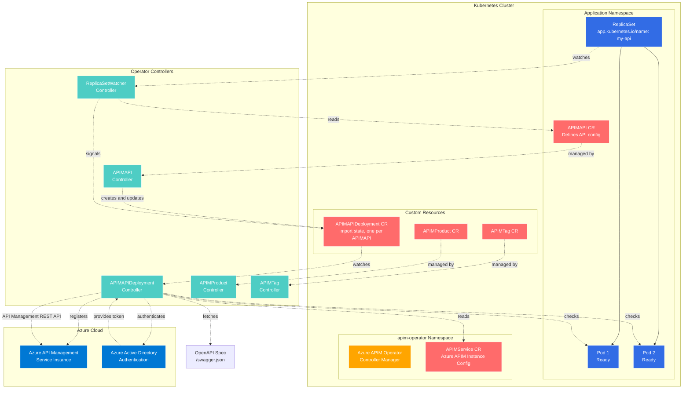
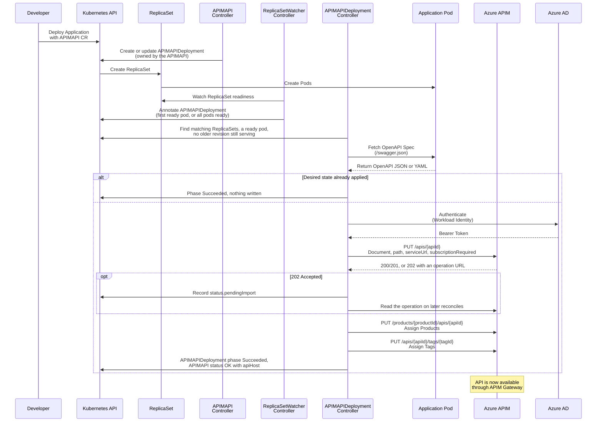
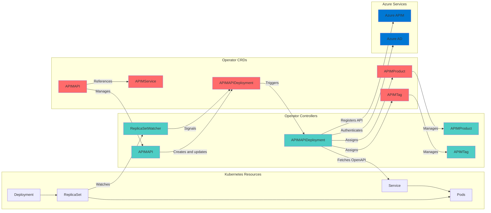
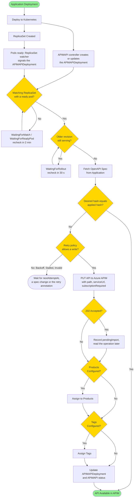

# Azure APIM Operator for Kubernetes

<div align="center">


**Seamlessly deploy and manage APIs in Azure API Management directly from Kubernetes**

[Features](#-features) • [Quick Start](#-quick-start) • [Architecture](#-architecture) • [Documentation](#-documentation)

</div>

---

## 📋 Overview

The **Azure APIM Operator** is a Kubernetes operator built with **Kubebuilder** and **Go** that automates the registration and management of APIs in Azure API Management (APIM). It provides a declarative, GitOps-friendly way to manage your API lifecycle by leveraging Kubernetes Custom Resource Definitions (CRDs).

### Key Benefits

- ✅ **Automated API Registration** - APIs are automatically registered in Azure APIM when deployed to Kubernetes
- ✅ **OpenAPI Integration** - Automatically fetches and imports OpenAPI/Swagger specifications
- ✅ **Declarative Management** - Manage APIs, Products, and Tags using Kubernetes resources
- ✅ **GitOps Ready** - Works seamlessly with GitOps workflows and CI/CD pipelines
- ✅ **Production Ready** - Built with enterprise-grade features including RBAC, metrics, and health checks

---

## 📌 Features

- **Automatic API Registration** - Detects new deployments and automatically registers them in Azure APIM
- **OpenAPI/Swagger Integration** - Fetches OpenAPI definitions from your deployed services
- **WebSocket APIs** - Declares `type: websocket` APIs (SignalR hubs, socket servers) that have no OpenAPI document
- **Product Management** - Automatically assigns APIs to APIM Products
- **Tag Management** - Organize APIs with tags for better categorization
- **Service URL Updates** - Automatically updates backend service URLs in APIM
- **Revision Support** - Manages API revisions in Azure APIM
- **Azure Workload Identity** - Secure authentication using Azure Workload Identity
- **Helm Deployment** - Easy installation and lifecycle management via Helm charts
- **Multi-Namespace Support** - Deploy APIs across multiple Kubernetes namespaces
- **Observability** - Built-in metrics, health checks, and structured logging

---

## 📚 Prerequisites

### Required Tools

- **Kubernetes** cluster (1.21+) - AKS, EKS, GKE, or any compatible distribution
- **kubectl** - Configured to access your cluster
- **Helm** (3.8+) - For operator installation
- **Azure CLI** - For Azure resource management (optional)

### Azure Requirements

- **Azure Subscription** with an Azure API Management instance
- **Azure Workload Identity** configured (or Service Principal credentials)
- **RBAC Permissions** - The identity needs permissions to manage APIM resources:
  - `Microsoft.ApiManagement/service/apis/*`
  - `Microsoft.ApiManagement/service/products/*`
  - `Microsoft.ApiManagement/service/tags/*`

### Development Tools (for building from source)

- **Go** (1.21+)
- **Kubebuilder** (`go install sigs.k8s.io/kubebuilder/...`)
- **Docker** - For building container images

---

## 🚀 Quick Start

### Step 1: Install the Operator

Deploy the operator using Helm:

```bash
helm upgrade --install azure-apim-operator ./charts/azure-apim-operator \
  --namespace apim-operator \
  --create-namespace
```

### Step 2: Configure Azure APIM Service

Create an `APIMService` resource to define your Azure APIM instance:

```yaml
apiVersion: apim.operator.io/v1
kind: APIMService
metadata:
  name: my-apim-instance
  namespace: apim-operator
spec:
  name: my-apim-service
  resourceGroup: my-resource-group
  subscription: <your-azure-subscription-id>
```

### Step 3: Configure Authentication

The operator authenticates with Azure Workload Identity only. Set the managed identity in
the chart values; the chart annotates the ServiceAccount and labels the pod, and the
Workload Identity webhook injects `AZURE_CLIENT_ID` and `AZURE_TENANT_ID`:

```yaml
serviceAccount:
  workloadIdentity:
    enabled: true
    clientID: "<your-managed-identity-client-id>"
    tenantID: "<your-azure-tenant-id>"
```

The resulting ServiceAccount looks like this:

```yaml
apiVersion: v1
kind: ServiceAccount
metadata:
  name: azure-apim-operator
  namespace: apim-operator
  annotations:
    azure.workload.identity/client-id: "<your-managed-identity-client-id>"
```

### Step 4: Register Your First API

Create an `APIMAPI` resource for your application:

```yaml
apiVersion: apim.operator.io/v1
kind: APIMAPI
metadata:
  name: my-api
  namespace: default
spec:
  APIID: my-api
  serviceUrl: https://my-api.example.com
  routePrefix: /api/v1
  openApiDefinitionUrl: https://my-api.example.com/swagger/v1/swagger.json
  apimService: my-apim-instance
  productIds:
    - my-product
  tagIds:
    - backend
    - v1
```

Apply the configuration:

```bash
kubectl apply -f my-api.yaml
```

### Step 5: Deploy Your Application

Deploy your application with the correct labels:

```yaml
apiVersion: apps/v1
kind: Deployment
metadata:
  name: my-api
  labels:
    app.kubernetes.io/name: my-api
spec:
  replicas: 2
  selector:
    matchLabels:
      app.kubernetes.io/name: my-api
  template:
    metadata:
      labels:
        app.kubernetes.io/name: my-api
    spec:
      containers:
      - name: api
        image: my-api:latest
        ports:
        - containerPort: 8080
---
apiVersion: networking.k8s.io/v1
kind: Ingress
metadata:
  name: my-api
spec:
  rules:
  - host: my-api.example.com
    http:
      paths:
      - path: /
        pathType: Prefix
        backend:
          service:
            name: my-api
            port:
              number: 80
```

The operator will automatically:
1. Create an `APIMAPIDeployment` for the `APIMAPI` (same name, owned by it; it holds the import state and stays)
2. Detect the ReplicaSet when its pods are ready, and wait for a rolling update to finish
3. Fetch the OpenAPI specification
4. Import the API into Azure APIM, with its path, backend URL and subscription requirement in the same request, unless APIM already holds this exact state
5. Follow the import on later reconciles when Azure returns `202 Accepted`
6. Assign products and tags
7. Write the API host to the `APIMAPI` status

### Step 6: Verify Installation

Check that CRDs are installed:

```bash
kubectl get crds | grep apim.operator.io
```

Check operator status:

```bash
kubectl get pods -n apim-operator
kubectl logs -l app.kubernetes.io/name=azure-apim-operator -n apim-operator
```

Check API registration status:

```bash
kubectl get apimapi -A
kubectl describe apimapi my-api
```

---

## 🏗️ Architecture

### System Architecture

The operator consists of multiple controllers that work together to automate API management:


```mermaid
graph TB
    subgraph K8s["Kubernetes Cluster"]
        subgraph AppNS["Application Namespace"]
            RS[ReplicaSet<br/>app.kubernetes.io/name: my-api]
            Pod1[Pod 1<br/>Ready]
            Pod2[Pod 2<br/>Ready]
            APIMAPI[APIMAPI CR<br/>Defines API config]
            
            RS --> Pod1
            RS --> Pod2
        end
        
        subgraph OperatorNS["apim-operator Namespace"]
            Operator[Azure APIM Operator<br/>Controller Manager]
            APIMService[APIMService CR<br/>Azure APIM Instance Config]
        end
        
        subgraph CRDs["Custom Resources"]
            APIMAPIDeploy[APIMAPIDeployment CR<br/>Import state, one per APIMAPI]
            APIMProduct[APIMProduct CR]
            APIMTag[APIMTag CR]
        end
    end
    
    subgraph Azure["Azure Cloud"]
        APIM[Azure API Management<br/>Service Instance]
        AAD[Azure Active Directory<br/>Authentication]
    end
    
    subgraph Controllers["Operator Controllers"]
        RSWatcher[ReplicaSetWatcher<br/>Controller]
        DeployController[APIMAPIDeployment<br/>Controller]
        APIController[APIMAPI<br/>Controller]
        ProductController[APIMProduct<br/>Controller]
        TagController[APIMTag<br/>Controller]
    end
    
    %% Watch Flow
    RS -.watches.-> RSWatcher
    RSWatcher -.reads.-> APIMAPI
    
    %% Creation and signal flow
    APIController -.creates and updates.-> APIMAPIDeploy
    RSWatcher -.signals.-> APIMAPIDeploy
    
    %% Deployment Flow
    APIMAPIDeploy -.watches.-> DeployController
    DeployController -.checks.-> Pod1
    DeployController -.checks.-> Pod2
    DeployController -.reads.-> APIMService
    DeployController -.fetches.-> OpenAPI[OpenAPI Spec<br/>/swagger.json]
    DeployController -.authenticates.-> AAD
    DeployController -.registers.-> APIM
    
    %% Configuration Flow
    APIMAPI -.managed by.-> APIController
    APIMProduct -.managed by.-> ProductController
    APIMTag -.managed by.-> TagController
    
    %% Azure Integration
    AAD -.provides token.-> DeployController
    DeployController -.API Management REST API.-> APIM
    
    %% Styling
    classDef k8sResource fill:#326ce5,stroke:#fff,color:#fff
    classDef crd fill:#ff6b6b,stroke:#fff,color:#fff
    classDef controller fill:#4ecdc4,stroke:#fff,color:#fff
    classDef azure fill:#0078d4,stroke:#fff,color:#fff
    classDef operator fill:#ffa500,stroke:#fff,color:#fff
    
    class RS,Pod1,Pod2 k8sResource
    class APIMAPI,APIMAPIDeploy,APIMService,APIMProduct,APIMTag crd
    class RSWatcher,DeployController,APIController,ProductController,TagController controller
    class APIM,AAD azure
    class Operator operator
```

### Workflow Sequence

The following diagram illustrates the complete workflow from application deployment to API registration:


```mermaid
sequenceDiagram
    participant Dev as Developer
    participant K8s as Kubernetes API
    participant RS as ReplicaSet
    participant APICtrl as APIMAPI<br/>Controller
    participant RSWatcher as ReplicaSetWatcher<br/>Controller
    participant DeployCtrl as APIMAPIDeployment<br/>Controller
    participant App as Application Pod
    participant AzureAPIM as Azure APIM
    participant AAD as Azure AD

    Dev->>K8s: Deploy Application<br/>with APIMAPI CR
    APICtrl->>K8s: Create or update APIMAPIDeployment<br/>(owned by the APIMAPI)
    K8s->>RS: Create ReplicaSet
    RS->>App: Create Pods
    
    RSWatcher->>RS: Watch ReplicaSet readiness
    RSWatcher->>K8s: Annotate APIMAPIDeployment<br/>(first ready pod, or all pods ready)
    
    DeployCtrl->>K8s: Find matching ReplicaSets, a ready pod,<br/>no older revision still serving
    DeployCtrl->>App: Fetch OpenAPI Spec<br/>(/swagger.json)
    App-->>DeployCtrl: Return OpenAPI JSON or YAML
    
    alt Desired state already applied
        DeployCtrl->>K8s: Phase Succeeded, nothing written
    else
        DeployCtrl->>AAD: Authenticate<br/>(Workload Identity)
        AAD-->>DeployCtrl: Bearer Token
        
        DeployCtrl->>AzureAPIM: PUT /apis/{apiId}<br/>Document, path, serviceUrl, subscriptionRequired
        AzureAPIM-->>DeployCtrl: 200/201, or 202 with an operation URL
        
        opt 202 Accepted
            DeployCtrl->>K8s: Record status.pendingImport
            DeployCtrl->>AzureAPIM: Read the operation on later reconciles
        end
        
        DeployCtrl->>AzureAPIM: PUT /products/{productId}/apis/{apiId}<br/>Assign Products
        DeployCtrl->>AzureAPIM: PUT /apis/{apiId}/tags/{tagId}<br/>Assign Tags
        
        DeployCtrl->>K8s: APIMAPIDeployment phase Succeeded,<br/>APIMAPI status OK with apiHost
    end
    
    Note over AzureAPIM: API is now available<br/>through APIM Gateway
```

### Component Interaction


```mermaid
graph LR
    subgraph "Kubernetes Resources"
        A[Deployment]
        B[ReplicaSet]
        C[Pods]
        E[Service]
    end
    
    subgraph "Operator CRDs"
        F[APIMAPI]
        G[APIMAPIDeployment]
        H[APIMService]
        I[APIMProduct]
        J[APIMTag]
    end
    
    subgraph "Operator Controllers"
        K[ReplicaSetWatcher]
        L[APIMAPIDeployment]
        M[APIMAPI]
        O[APIMProduct]
        P[APIMTag]
    end
    
    subgraph "Azure Services"
        Q[Azure APIM]
        R[Azure AD]
    end
    
    A --> B
    B --> C
    E --> C
    
    B -->|Watches| K
    F -->|References| H
    M -->|Creates and updates| G
    K -->|Signals| G
    G -->|Triggers| L
    
    L -->|Fetches OpenAPI| E
    L -->|Authenticates| R
    L -->|Registers API| Q
    L -->|Assigns| I
    L -->|Assigns| J
    
    F -->|Manages| M
    I -->|Manages| O
    J -->|Manages| P
    
    style F fill:#ff6b6b
    style G fill:#ff6b6b
    style H fill:#ff6b6b
    style I fill:#ff6b6b
    style J fill:#ff6b6b
    style K fill:#4ecdc4
    style L fill:#4ecdc4
    style M fill:#4ecdc4
    style O fill:#4ecdc4
    style P fill:#4ecdc4
    style Q fill:#0078d4
    style R fill:#0078d4
```

### Data Flow


```mermaid
flowchart TD
    Start([Application Deployment]) --> Deploy[Deploy to Kubernetes]
    Deploy --> CreateCR[APIMAPI controller creates or updates<br/>the APIMAPIDeployment]
    Deploy --> RS[ReplicaSet Created]
    RS --> Signal[Pods ready: ReplicaSet watcher<br/>signals the APIMAPIDeployment]
    CreateCR --> Ready
    Signal --> Ready{Matching ReplicaSet<br/>with a ready pod?}
    Ready -->|No| Wait[WaitingForMatch / WaitingForReadyPod<br/>recheck in 2 min]
    Wait --> Ready
    Ready -->|Yes| Rollout{Older revision<br/>still serving?}
    Rollout -->|Yes| WaitRollout[WaitingForRollout<br/>recheck in 30 s]
    WaitRollout --> Rollout
    Rollout -->|No| FetchOpenAPI[Fetch OpenAPI Spec<br/>from Application]
    FetchOpenAPI --> InSync{Desired hash equals<br/>applied hash?}
    InSync -->|Yes| End
    InSync -->|No| Gate{Retry policy<br/>allows a write?}
    Gate -->|No: Backoff, Stalled, Invalid| Held([Wait for nextAttemptAt,<br/>a spec change or the retry annotation])
    Gate -->|Yes| ImportAPI[PUT API to Azure APIM<br/>with path, serviceUrl, subscriptionRequired]
    ImportAPI --> Pending{202 Accepted?}
    Pending -->|Yes| Follow[Record pendingImport,<br/>read the operation later]
    Follow --> AssignProducts
    Pending -->|No| AssignProducts{Products<br/>Configured?}
    AssignProducts -->|Yes| AssignProd[Assign to Products]
    AssignProducts -->|No| AssignTags
    AssignProd --> AssignTags{Tags<br/>Configured?}
    AssignTags -->|Yes| AssignTag[Assign Tags]
    AssignTags -->|No| UpdateStatus
    AssignTag --> UpdateStatus[Update APIMAPIDeployment<br/>and APIMAPI status]
    UpdateStatus --> End([API Available in APIM])
    
    style Start fill:#90EE90
    style End fill:#90EE90
    style Ready fill:#FFD700
    style Rollout fill:#FFD700
    style InSync fill:#FFD700
    style Gate fill:#FFD700
    style Pending fill:#FFD700
    style AssignProducts fill:#FFD700
    style AssignTags fill:#FFD700
```

---

## 🔄 How It Works

### Controller Architecture

The operator consists of several specialized controllers:

#### 1. **ReplicaSet Watcher Controller**

- **Purpose**: Monitors Kubernetes ReplicaSets and triggers API registration
- **Behavior**:
  - Reacts when a ReplicaSet gets its first ready pod, or all its pods ready
  - Matches ReplicaSets to `APIMAPI` resources by `spec.target.selector`, or by the `app.kubernetes.io/name` label when no selector is set
  - Makes sure the matching `APIMAPIDeployment` exists and annotates it, which makes the deployment controller reconcile it

#### 2. **APIMAPIDeployment Controller**

- **Purpose**: Handles the actual API registration in Azure APIM
- **Behavior**:
  - Watches for `APIMAPIDeployment` resources
  - Waits for a matching ReplicaSet with a ready pod and for a rolling update to finish
  - Fetches OpenAPI/Swagger specification from the application endpoint
  - Skips APIM entirely when the desired state (spec and document hash) is already applied
  - Authenticates with Azure AD using Workload Identity
  - Imports the API into Azure APIM with one `PUT` that also sets the path, backend service URL and subscription requirement
  - When APIM answers `202 Accepted`, records the operation in `status.pendingImport` and reads it on later reconciles instead of waiting or importing again
  - Assigns products and tags if configured
  - Backs off after failed writes, and stops (`Stalled` or `Invalid`) until the spec changes or the `apim.operator.io/retry` annotation is set
  - Keeps the resource and its status after the import; it goes away with its `APIMAPI`

#### 3. **APIMAPI Controller**

- **Purpose**: Manages the lifecycle of `APIMAPI` resources
- **Behavior**: Creates the `APIMAPIDeployment` for each `APIMAPI` and keeps its spec in line; sets the ArgoCD external-link annotation from `status.apiHost`

`APIMService` has no controller: it is a configuration record the other controllers read to locate the APIM instance.

#### 4. **APIMProduct Controller**

- **Purpose**: Creates and manages APIM Products
- **Behavior**: Synchronizes Product definitions with Azure APIM

#### 5. **APIMTag Controller**

- **Purpose**: Creates and manages APIM Tags
- **Behavior**: Synchronizes Tag definitions with Azure APIM

---

## 📝 Custom Resources

### APIMService

Defines an Azure API Management service instance:

```yaml
apiVersion: apim.operator.io/v1
kind: APIMService
metadata:
  name: my-apim-service
  namespace: apim-operator
spec:
  name: my-apim-service-name          # APIM service name in Azure
  resourceGroup: my-resource-group    # Azure resource group
  subscription: <subscription-id>     # Azure subscription ID
```

### APIMAPI

Defines an API to be registered in Azure APIM:

```yaml
apiVersion: apim.operator.io/v1
kind: APIMAPI
metadata:
  name: my-api
  namespace: default
spec:
  APIID: my-api                       # Unique API identifier in APIM
  serviceUrl: https://api.example.com  # Backend service URL
  routePrefix: /api/v1                # Route prefix in APIM
  openApiDefinitionUrl: https://api.example.com/swagger.json  # OpenAPI spec URL
  apimService: my-apim-service        # Reference to APIMService
  productIds:                          # Optional: Product IDs to assign
    - my-product
  tagIds:                             # Optional: Tag IDs to assign
    - backend
    - v1
```

A WebSocket API has no OpenAPI document. Set `type: websocket`, give it a
`ws://` or `wss://` backend and skip `openApiDefinitionUrl`; APIM adds the
`onHandshake` operation itself:

```yaml
apiVersion: apim.operator.io/v1
kind: APIMAPI
metadata:
  name: orders-hub
  namespace: default
spec:
  APIID: orders-hub
  type: websocket
  websocket:                            # Optional block, only allowed for type: websocket
    displayName: Orders - SignalR hub   # Defaults to APIID
    protocols: [wss]                    # Defaults to [wss]
  serviceUrl: wss://orders.internal.example.com/hub
  routePrefix: /orders/hub
  apimService: my-apim-service
  productIds:
    - my-product
```

### APIMProduct

Defines an APIM Product:

```yaml
apiVersion: apim.operator.io/v1
kind: APIMProduct
metadata:
  name: my-product
  namespace: default
spec:
  productId: my-product
  displayName: My Product
  description: Product description
  apimService: my-apim-service
  published: true
```

### APIMTag

Defines an APIM Tag:

```yaml
apiVersion: apim.operator.io/v1
kind: APIMTag
metadata:
  name: my-tag
  namespace: default
spec:
  tagId: my-tag
  displayName: My Tag
  apimService: my-apim-service
```

---

## 🔐 Authentication

The operator supports Azure Workload Identity for secure, passwordless authentication.

### Azure Workload Identity Setup

1. **Create a Managed Identity** in Azure:

```bash
az identity create --name apim-operator-identity --resource-group my-resource-group
```

2. **Grant Permissions** to the Managed Identity:

```bash
# Get the principal ID
PRINCIPAL_ID=$(az identity show --name apim-operator-identity --resource-group my-resource-group --query principalId -o tsv)

# Grant API Management Contributor role
az role assignment create \
  --assignee $PRINCIPAL_ID \
  --role "API Management Service Contributor" \
  --scope "/subscriptions/<subscription-id>/resourceGroups/<resource-group>/providers/Microsoft.ApiManagement/service/<apim-service-name>"
```

3. **Configure the Service Account** with Workload Identity:

```yaml
apiVersion: v1
kind: ServiceAccount
metadata:
  name: azure-apim-operator
  namespace: apim-operator
  annotations:
    azure.workload.identity/client-id: "<managed-identity-client-id>"
```

4. **Environment variables** are not set by hand: the Workload Identity webhook injects
   `AZURE_CLIENT_ID` and `AZURE_TENANT_ID` into the pod (labelled
   `azure.workload.identity/use: "true"` by the chart). A service principal secret is not
   supported; the operator uses Workload Identity only.

---

## 📦 Building & Deployment

### Build Docker Image

Build and push the Docker image using the provided script:

```bash
./scripts/docker.sh v1.0.0
```

This script:
- Builds the Go application
- Creates a Docker image
- Tags it with the version
- Pushes to Azure Container Registry (if configured)

### Deploy Helm Chart

Package and deploy the Helm chart:

```bash
# Package the chart
./scripts/helm.sh 1.0.0

# Or install directly
helm upgrade --install azure-apim-operator ./charts/azure-apim-operator \
  --namespace apim-operator \
  --create-namespace \
  --set image.tag=v1.0.0
```

### Customize Installation

You can customize the installation using Helm values:

```yaml
# values.yaml
replicaCount: 2

image:
  repository: myregistry.azurecr.io/azure-apim-operator
  tag: v1.0.0
  pullPolicy: IfNotPresent

serviceAccount:
  workloadIdentity:
    clientID: "<your-client-id>"
    tenantID: "<your-tenant-id>"

resources:
  limits:
    cpu: 500m
    memory: 512Mi
  requests:
    cpu: 100m
    memory: 128Mi
```

---

## 🔢 Versioning

One number describes a whole release - chart, app, git tag and image always match:

- `charts/azure-apim-operator/Chart.yaml` is the single source of truth:
  `version` and `appVersion` are kept equal (e.g. `0.26.2`).
- The git tag is the same number with a `v` prefix (`v0.26.2`), and the tag
  build pushes the **immutable** image tag `v0.26.2` plus chart `0.26.2` to
  both ACR (internal deploys) and GHCR (public consumers).
- The chart defaults its image to `v<appVersion>`, and clusters pin only the
  chart version (`params.libsonnet` in `hedin-applications-state`), so bumping
  that one pin is the whole rollout.

So: same number everywhere, and if you know the chart version you know the
exact commit that is running.

## 🚢 Releases

Two workflows follow the shared operator release contract (the same as
`k8m8-operator` / `nova-operator` / `helmut-operator`). Pull requests and `main` pushes
only build and validate; a `vX.Y.Z` tag publishes:

- `.github/workflows/publish-image.yml` → the image `azure-apim-operator:vX.Y.Z` to ACR,
  and to `ghcr.io/hedinbil` as a secondary target.
- `.github/workflows/publish-chart.yml` → the chart to `charts-src/azure-apim-operator` in
  ACR, which Helmut mirrors into `helm-charts`, the path the clusters consume; and to
  `oci://ghcr.io/hedinbil/charts` as a secondary target.

Releases are cut by pushing a semver git tag:

1. Bump `version` and `appVersion` in `charts/azure-apim-operator/Chart.yaml` (kept equal).
2. Merge to `main`, then tag the commit `vX.Y.Z` and push the tag.
3. The tag build pushes the immutable image tag `vX.Y.Z` and the chart version `X.Y.Z`. The deployment defaults its image to
   `v<appVersion>`, so the chart pin alone determines the exact code deployed
   and ArgoCD rolls pods on sync.

ArgoCD deploys the chart from ACR (see `hedin-applications-state`:
`libs/helm-charts/azure-apim-operator/<version>/` for chart values and
`clusters/<env>/<cluster>/azure-apim-operator/` for per-cluster overrides).
The ACR workflows run in the GitHub environment `acr`, whose ref-independent
OIDC subject (`repo:hedinbil/azure-apim-operator:environment:acr`) covers both
`main` pushes and tag builds (federated credential in the
`hedin-infrastructure-state` prod landing-zone).

---

## 🛡️ RBAC Permissions

The operator requires specific RBAC permissions to function. These are automatically created by the Helm chart.

### Required Permissions

- **Read ReplicaSets** - To detect application deployments
- **Read Pods** - To check pod readiness
- **Manage CRDs** - To create and manage custom resources
- **Update Status** - To update resource status

### Customizing RBAC

RBAC permissions can be customized by editing:

- `config/rbac/role.yaml` - For CRDs and Kubernetes built-in resources
- `charts/azure-apim-operator/templates/clusterrole.yaml` - Helm chart RBAC

After changes, regenerate manifests:

```bash
make manifests
```

---

## 📊 Monitoring & Observability

### Health Checks

The operator exposes health check endpoints:

- **Liveness Probe**: `/healthz`
- **Readiness Probe**: `/readyz`

### Metrics

The operator exposes Prometheus metrics as plain HTTP on port 8080 (chart values `metrics.enabled`, on by default, and `metrics.port`). The chart ships no Service; the pod carries a Datadog openmetrics annotation so the node agent scrapes it.

### Logging

View operator logs:

```bash
# All pods
kubectl logs -l app.kubernetes.io/name=azure-apim-operator -n apim-operator

# Specific pod
kubectl logs -n apim-operator <pod-name>

# Follow logs
kubectl logs -f -l app.kubernetes.io/name=azure-apim-operator -n apim-operator
```

### Status Tracking

Check the status of your APIs:

```bash
# List all APIs
kubectl get apimapi -A

# Detailed status
kubectl describe apimapi <api-name> -n <namespace>

# Check deployment status
kubectl get apimapideployment -A
```

---

## 🐛 Troubleshooting

### Common Issues

#### 1. CRDs Not Installed

**Symptoms**: Custom resources not recognized

**Solution**:
```bash
# Check if CRDs exist
kubectl get crds | grep apim.operator.io

# If missing, install them
kubectl apply -f config/crd/bases/
```

#### 2. Authentication Failures

**Symptoms**: `Failed to get Azure token` errors

**Solution**:
- Verify `AZURE_CLIENT_ID` and `AZURE_TENANT_ID` are set
- Check Workload Identity configuration
- Verify Managed Identity has correct permissions
- Check Service Account annotations

#### 3. API Not Registering

**Symptoms**: API not appearing in Azure APIM

**Solution**:
- Check ReplicaSet Watcher logs
- Verify `APIMAPI` resource exists and is correct
- Ensure pods are ready
- Check `APIMAPIDeployment` status

#### 4. Import Returns 202 But Endpoints Are Missing

**Symptoms**:
- The `APIMAPIDeployment` is in phase `Importing` with `status.pendingImport` set, and new endpoints are not visible in APIM yet
- Azure import request returns `202 Accepted`

**What it means**:
- Azure APIM import is asynchronous and may still be processing (or may fail later). The operator records the operation and reads it on later reconciles; it does not import again while it runs

**What to check in logs**:
- `📥 OpenAPI definition downloaded` - the document was fetched (with its size in `bytes`)
- `⏳ APIM accepted the import; following it` - APIM answered `202`; the operation is recorded
- `⏳ APIM is still importing the definition it accepted at ...` - operation still running
- `✅ APIM finished the import it accepted at ...` - operation succeeded; products, tags and status follow
- `🚫 APIM reported that the import it accepted at ... failed` - operation failed; counted as a failed write

**Solution**:
- Wait: the operation is read every 15 seconds at first, then less often, for up to two hours
- If it fails, read `status.lastError` on the `APIMAPIDeployment` for APIM's validation details
- Fix the document and roll out the application; a `Stalled` or `Invalid` deployment can also be reset with the `apim.operator.io/retry` annotation (see [Troubleshooting](docs/troubleshooting.md#retries-and-recovery))

#### 5. Duplicate Operation Error on Re-Import

**Symptoms**: `ValidationError` stating an operation already exists when the operator re-imports an API

**Cause**: APIM uses the OpenAPI `operationId` as the internal resource name. If your spec omits `operationId`, APIM auto-generates resource names on first import and generates different names on subsequent imports, so it tries to create duplicates instead of updating.

**Solution**:
- Add a stable, unique `operationId` to every operation in your OpenAPI spec and re-deploy
- See the [Best Practices](#-best-practices) section for framework-specific examples

#### 6. OpenAPI Fetch Fails

**Symptoms**: Cannot fetch OpenAPI specification

**Solution**:
- Verify the OpenAPI URL is accessible from the operator pod
- Check network policies
- Verify the endpoint returns valid OpenAPI JSON
- Check application logs

#### 7. Products/Tags Not Assigned

**Symptoms**: API registered but products/tags missing

**Solution**:
- Ensure `APIMProduct` and `APIMTag` resources exist
- Verify product/tag IDs match
- Check operator logs for assignment errors

### Debug Commands

```bash
# Check operator pod status
kubectl get pods -n apim-operator

# View detailed pod information
kubectl describe pod -n apim-operator <pod-name>

# Check events
kubectl get events -n apim-operator --sort-by='.lastTimestamp'

# Check CRD status
kubectl get apimapi -A -o yaml
kubectl get apimapideployment -A -o yaml

# Check RBAC
kubectl get clusterrole azure-apim-operator-manager-role -o yaml
kubectl get clusterrolebinding azure-apim-operator-manager-rolebinding -o yaml

# Tail operator logs and focus on the OpenAPI import lifecycle and APIM writes
kubectl logs -f -l app.kubernetes.io/name=azure-apim-operator -n apim-operator \
  | egrep "OpenAPI definition downloaded|APIM write|APIM accepted the import|importing the definition|import it accepted"
```

---

## 🌟 Best Practices

### Application Deployment

1. **Label Your Resources**: Always use `app.kubernetes.io/name` label on Deployments and ReplicaSets
   ```yaml
   metadata:
     labels:
       app.kubernetes.io/name: my-api
   ```

2. **Health Checks**: Implement proper readiness and liveness probes in your applications

3. **OpenAPI Endpoint**: Ensure your OpenAPI/Swagger endpoint is accessible and returns valid JSON

4. **Set `operationId` on Every Operation**: Your OpenAPI spec **must** include a stable, unique `operationId` for each operation. APIM uses the `operationId` as the internal resource name to match incoming operations against existing ones during re-imports. Without it, APIM auto-generates resource names on first import and generates *different* names on subsequent imports, causing `ValidationError: Operation already exists` failures.

   Common framework examples:

   **ASP.NET Minimal API** — use `.WithName()`:
   ```csharp
   app.MapGet("/pets", GetPets).WithName("GetPets");
   app.MapPost("/pets", CreatePet).WithName("CreatePet");
   ```

   **ASP.NET Controllers** — the method name is used automatically, or set it explicitly:
   ```csharp
   [HttpGet("pets", Name = "GetPets")]
   public IActionResult GetPets() { ... }
   ```

   **Raw OpenAPI YAML/JSON**:
   ```yaml
   paths:
     /pets:
       get:
         operationId: GetPets
   ```

### API Configuration

1. **Unique API IDs**: Use unique, descriptive API IDs across all namespaces

2. **Route Prefixes**: Use consistent route prefix conventions (e.g., `/api/v1`, `/api/v2`)

3. **Service URLs**: Point to stable service endpoints (use Ingress hostnames or Service FQDNs)

4. **Products & Tags**: Organize APIs using products and tags for better management

### Security

1. **Least Privilege**: Grant only necessary permissions to the Managed Identity

2. **Network Policies**: Implement network policies to restrict operator access if needed

3. **Secrets Management**: Use Azure Key Vault or Kubernetes secrets for sensitive configuration

4. **RBAC**: Regularly audit RBAC permissions and remove unnecessary access

### Monitoring

1. **Alerting**: Set up alerts for operator failures and API registration issues

2. **Logging**: Centralize logs for better observability

3. **Metrics**: Monitor operator metrics and API registration success rates

4. **Status Checks**: Regularly check API status in both Kubernetes and Azure APIM

---

## 📚 Additional Resources

- [Kubebuilder Documentation](https://book.kubebuilder.io/)
- [Azure API Management Documentation](https://docs.microsoft.com/azure/api-management/)
- [Azure Workload Identity](https://azure.github.io/azure-workload-identity/docs/)
- [Kubernetes Operators](https://kubernetes.io/docs/concepts/extend-kubernetes/operator/)

---

## 🤝 Contributing

Contributions are welcome! Please feel free to submit a Pull Request.

1. Fork the repository
2. Create your feature branch (`git checkout -b feature/amazing-feature`)
3. Commit your changes (`git commit -m 'Add some amazing feature'`)
4. Push to the branch (`git push origin feature/amazing-feature`)
5. Open a Pull Request

---

## 📄 License

This project is licensed under the Apache License 2.0 - see the [LICENSE](LICENSE) file for details.

---

## 🙏 Acknowledgments

- Built with [Kubebuilder](https://kubebuilder.io/)
- Uses [controller-runtime](https://github.com/kubernetes-sigs/controller-runtime)
- Azure SDK for Go

---

<div align="center">

**Copyright 2025 Hedin IT**

Licensed under the Apache License, Version 2.0

[Report Bug](https://github.com/hedinit/azure-apim-operator/issues) • [Request Feature](https://github.com/hedinit/azure-apim-operator/issues) • [Documentation](https://github.com/hedinit/azure-apim-operator)

</div>
