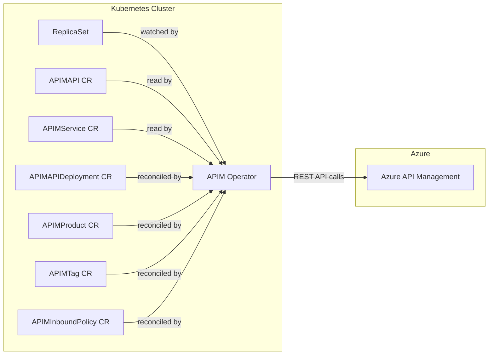
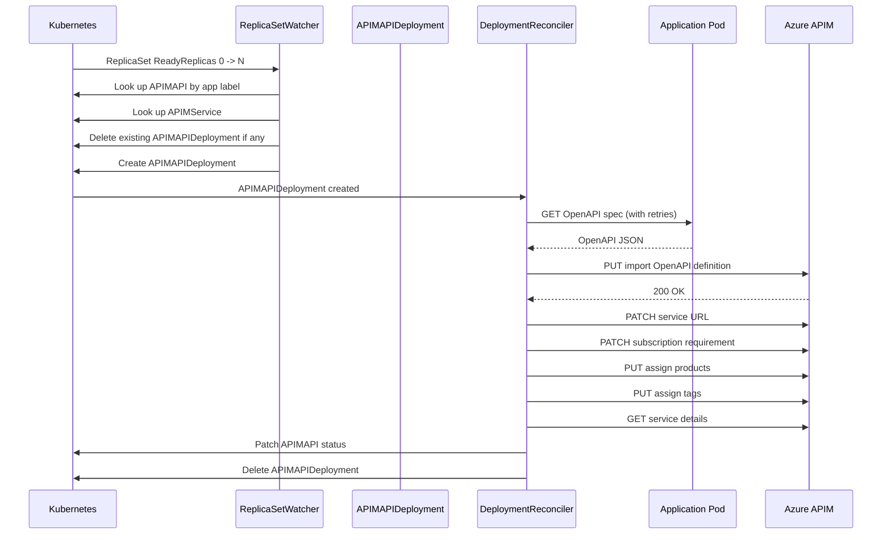
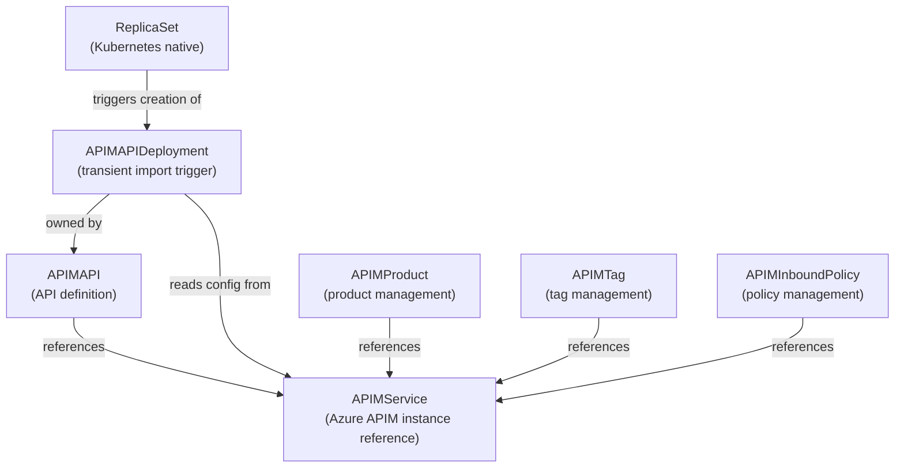

# Architecture

This document describes how the Azure APIM Operator works internally, including its controller architecture, reconciliation flows, and integration with the Azure APIM REST API.

## High-Level Overview

The operator runs as a Kubernetes controller manager that watches custom resources and Kubernetes-native resources (ReplicaSets). When applications are deployed or updated, the operator automatically imports their OpenAPI specs into Azure API Management.



## Controllers

The operator registers seven controllers with the controller manager. Each controller watches specific resources and handles a distinct part of the APIM lifecycle.

| Controller | Watches | Purpose |
|------------|---------|---------|
| `ReplicaSetWatcherReconciler` | `apps/v1 ReplicaSet` | Detects application deployments and creates `APIMAPIDeployment` resources |
| `APIMAPIDeploymentReconciler` | `APIMAPIDeployment` | Fetches OpenAPI specs and imports them into APIM |
| `APIMAPIReconciler` | `APIMAPI` | Manages annotations (e.g., ArgoCD external links) |
| `APIMServiceReconciler` | `APIMService` | Placeholder (currently a no-op) |
| `APIMProductReconciler` | `APIMProduct` | Creates, updates, and deletes APIM products |
| `APIMTagReconciler` | `APIMTag` | Creates and updates APIM tags |
| `APIMInboundPolicyReconciler` | `APIMInboundPolicy` | Creates and updates inbound policies (API-level or operation-level) |

## Core Flow: Automatic API Import

The primary flow is triggered when an application is deployed or updated in the cluster. This involves two controllers working in sequence.



### Step 1: ReplicaSet Watcher

The `ReplicaSetWatcherReconciler` watches `apps/v1 ReplicaSet` resources. It triggers when:

- A ReplicaSet is **created** with `ReadyReplicas > 0`
- A ReplicaSet is **updated** and `ReadyReplicas` transitions from `0` to `> 0`

It ignores ReplicaSets scaled to 0 replicas (old revisions during rolling updates).

When triggered, it:

1. Extracts the `app.kubernetes.io/name` label from the ReplicaSet
2. Looks up an `APIMAPI` resource with a matching name in the same namespace
3. If found, looks up the referenced `APIMService` in the operator namespace
4. Deletes any existing `APIMAPIDeployment` for this app (to force a fresh import)
5. Waits for at least one ready pod owned by the ReplicaSet
6. Creates a new `APIMAPIDeployment` with all configuration from the `APIMAPI` and `APIMService`

### Step 2: API Deployment

The `APIMAPIDeploymentReconciler` processes `APIMAPIDeployment` resources (Create events only). It performs the full APIM import workflow:

1. **Fetch OpenAPI spec** from the URL specified in the resource (with exponential backoff: 2s, 4s, 8s, 16s, 32s -- up to 5 retries)
2. **Acquire Azure token** using Workload Identity (`AZURE_CLIENT_ID` and `AZURE_TENANT_ID` environment variables)
3. **Import the OpenAPI definition** into APIM via `PUT` with `?import=true`
4. **Patch the service URL** to point APIM to the backend service
5. **Set subscription requirement** (whether API keys are required)
6. **Assign products** to the API (if configured)
7. **Assign tags** to the API (if configured)
8. **Update APIMAPI status** with the API host URL and developer portal URL
9. **Delete the APIMAPIDeployment** resource (it is transient -- a one-shot trigger)

If any step fails, the controller requeues after 60 seconds (30 seconds for token failures).

## Event Filters

Each controller uses Kubernetes predicates to filter which events trigger reconciliation. This prevents unnecessary work and avoids duplicate processing.

| Controller | Create | Update | Delete | Notes |
|------------|--------|--------|--------|-------|
| ReplicaSetWatcher | Only if `ReadyReplicas > 0` | Only when `ReadyReplicas` goes from 0 to > 0 | No | Ignores scaled-to-0 ReplicaSets |
| APIMAPIDeployment | Yes | No | No | One-shot: processes on creation only |
| APIMAPI | No | Yes | No | Only processes updates (for annotations) |
| APIMProduct | Yes | No | Yes | Handles creation and deletion |
| APIMTag | Yes | No | No | Handles creation only |
| APIMInboundPolicy | Yes | Only if spec fields changed | No | Compares `apimService`, `apiId`, `operationId`, `policyContent` |

## APIM REST API Integration

The operator communicates with Azure APIM through the Azure Management REST API (`api-version=2021-08-01`). All requests use Bearer token authentication obtained via Workload Identity.

### ETag Handling

For API imports, the operator uses ETags for optimistic concurrency:

1. Before importing, it calls `GET` on the API to check if it exists and retrieve its ETag
2. If the API exists, the actual ETag is used in the `If-Match` header for conditional updates
3. If the API does not exist, `If-Match: *` is used for unconditional creation
4. For new revisions, `If-Match: *` is always used

### OpenAPI Import

The operator sends the raw OpenAPI JSON directly to APIM without parsing or transformation. The spec is fetched from the application's OpenAPI endpoint and forwarded as-is via:

```
PUT /subscriptions/{id}/resourceGroups/{rg}/providers/Microsoft.ApiManagement/service/{name}/apis/{apiId}
    ?api-version=2021-08-01
    &import=true
    &path={routePrefix}
Content-Type: application/vnd.oai.openapi+json
```

This means the quality and correctness of the OpenAPI spec is entirely the responsibility of the producing application. See [OpenAPI Spec Requirements](openapi-spec-requirements.md) for what APIM expects.

## Error Handling and Retry Strategy

| Scenario | Behavior |
|----------|----------|
| OpenAPI fetch failure | Exponential backoff (2s, 4s, 8s, 16s, 32s), up to 5 retries. If all fail, requeue after 60s |
| Azure token failure | Requeue after 30s |
| APIM import failure | Requeue after 60s |
| Service URL patch failure | Requeue after 60s |
| Product/tag assignment failure | Requeue after 60s |
| Status patch failure | Return error (immediate retry by controller runtime) |
| Resource not found | Ignored (no requeue) |

## Resource Relationships



- `APIMService` is the central reference -- all other resources point to it to identify which APIM instance to target
- `APIMAPI` declares that an API should be managed in APIM and holds the desired configuration
- `APIMAPIDeployment` is a transient resource created by the ReplicaSet watcher and deleted after successful import
- `APIMProduct`, `APIMTag`, and `APIMInboundPolicy` are independently managed supporting resources
