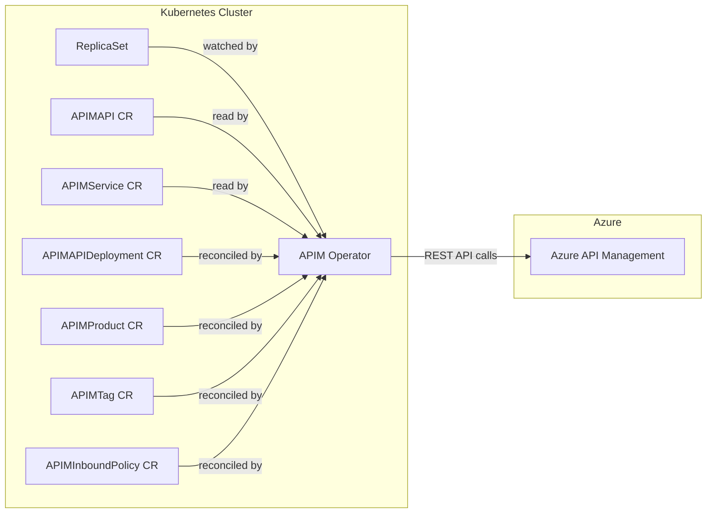
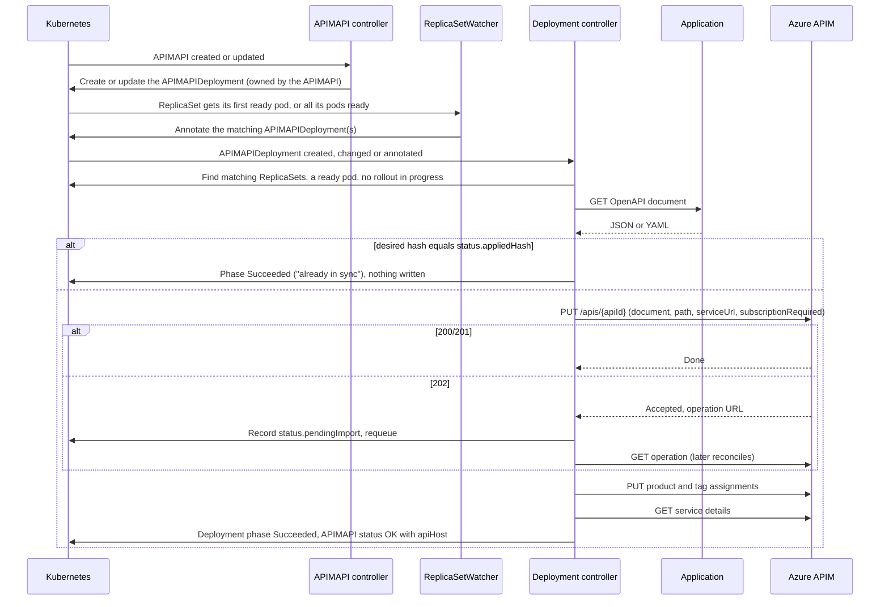
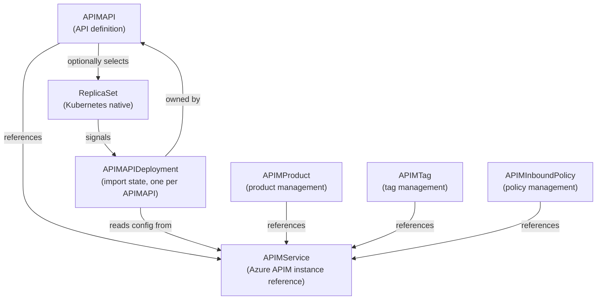

# Architecture

This document describes how the Azure APIM Operator works internally, including its controller architecture, reconciliation flows, and integration with the Azure APIM REST API.

## High-Level Overview

The operator runs as a Kubernetes controller manager that watches custom resources and Kubernetes-native resources (ReplicaSets). When applications are deployed or updated, the operator automatically imports their OpenAPI specs into Azure API Management. ReplicaSets are matched to `APIMAPI` resources through an optional label selector, with a legacy fallback to name-based matching.


```mermaid
flowchart LR
    subgraph k8s [Kubernetes Cluster]
        RS[ReplicaSet]
        APIMAPI[APIMAPI CR]
        APIMService[APIMService CR]
        Deployment[APIMAPIDeployment CR]
        Product[APIMProduct CR]
        Tag[APIMTag CR]
        Policy[APIMInboundPolicy CR]
        Operator[APIM Operator]
    end

    subgraph azure [Azure]
        APIM[Azure API Management]
    end

    RS -->|watched by| Operator
    APIMAPI -->|read by| Operator
    APIMService -->|read by| Operator
    Deployment -->|reconciled by| Operator
    Product -->|reconciled by| Operator
    Tag -->|reconciled by| Operator
    Policy -->|reconciled by| Operator
    Operator -->|REST API calls| APIM
```

## Controllers

The operator registers six controllers with the controller manager. Each controller watches specific resources and handles a distinct part of the APIM lifecycle.

| Controller | Watches | Purpose |
|------------|---------|---------|
| `ReplicaSetWatcherReconciler` | `apps/v1 ReplicaSet` | Signals the matching `APIMAPIDeployment` when a workload becomes ready |
| `APIMAPIDeploymentReconciler` | `APIMAPIDeployment` | Fetches the OpenAPI document, imports it into APIM, assigns products and tags |
| `APIMAPIReconciler` | `APIMAPI` | Keeps the `APIMAPIDeployment` in line with the `APIMAPI` and sets the ArgoCD external-link annotation |
| `APIMProductReconciler` | `APIMProduct` | Creates, updates, and deletes APIM products |
| `APIMTagReconciler` | `APIMTag` | Creates and updates APIM tags |
| `APIMInboundPolicyReconciler` | `APIMInboundPolicy` | Creates and updates inbound policies (API-level or operation-level) |

`APIMService` has no controller. It is a plain configuration record: the other
controllers read its `subscription` and `resourceGroup` to locate the APIM
instance. The no-op reconciler that used to watch it was removed in 0.28.0
along with the rest of the dead code (APIM-17).

## Core Flow: Automatic API Import

Every `APIMAPI` has one `APIMAPIDeployment` with the same name, owned by it. The `APIMAPI` controller creates it and copies the API's spec onto it on every create or update of the `APIMAPI`. It is not deleted after an import: it holds the import's state (hashes, a pending import, retry counters) and goes away only with its `APIMAPI`, through owner-reference garbage collection.


```mermaid
sequenceDiagram
    participant K8s as Kubernetes
    participant API as APIMAPI controller
    participant RSW as ReplicaSetWatcher
    participant ADR as Deployment controller
    participant App as Application
    participant APIM as Azure APIM

    K8s->>API: APIMAPI created or updated
    API->>K8s: Create or update the APIMAPIDeployment (owned by the APIMAPI)
    K8s->>RSW: ReplicaSet gets its first ready pod, or all its pods ready
    RSW->>K8s: Annotate the matching APIMAPIDeployment(s)
    K8s->>ADR: APIMAPIDeployment created, changed or annotated
    ADR->>K8s: Find matching ReplicaSets, a ready pod, no rollout in progress
    ADR->>App: GET OpenAPI document
    App-->>ADR: JSON or YAML
    alt desired hash equals status.appliedHash
        ADR->>K8s: Phase Succeeded ("already in sync"), nothing written
    else
        ADR->>APIM: PUT /apis/{apiId} (document, path, serviceUrl, subscriptionRequired)
        alt 200/201
            APIM-->>ADR: Done
        else 202
            APIM-->>ADR: Accepted, operation URL
            ADR->>K8s: Record status.pendingImport, requeue
            ADR->>APIM: GET operation (later reconciles)
        end
        ADR->>APIM: PUT product and tag assignments
        ADR->>APIM: GET service details
        ADR->>K8s: Deployment phase Succeeded, APIMAPI status OK with apiHost
    end
```

### Step 1: ReplicaSet Watcher

The `ReplicaSetWatcherReconciler` watches `apps/v1 ReplicaSet` resources. It reacts when:

- A ReplicaSet is **created** with `ReadyReplicas > 0`
- A ReplicaSet is **updated** and gets its first ready pod (`ReadyReplicas` from `0` to `> 0`), or all the pods it wants become ready

It ignores ReplicaSets scaled to 0 replicas (old revisions during rolling updates).

When triggered, it:

1. Lists `APIMAPI` resources in the same namespace and matches any `spec.target.selector` against the ReplicaSet labels
2. If `spec.target.selector` is omitted, falls back to the legacy rule: `APIMAPI.metadata.name == ReplicaSet.labels["app.kubernetes.io/name"]`
3. For each matched `APIMAPI`, makes sure its `APIMAPIDeployment` exists and matches the `APIMAPI`
4. Sets the `apim.operator.io/replicaset-signal` and `apim.operator.io/last-matched-replicaset` annotations on it, which makes the deployment controller reconcile it

One ReplicaSet can signal zero, one or many APIs. The watcher does not fetch anything or talk to APIM.

### Step 2: API Deployment

The `APIMAPIDeploymentReconciler` reconciles an `APIMAPIDeployment` when it is created, when its spec changes, when one of the signal annotations above changes, and when the `apim.operator.io/retry` annotation changes. Each reconcile:

1. **Finds the workload.** No matching ReplicaSet: phase `WaitingForMatch`. A match but no ready pod: `WaitingForReadyPod`. An older revision of the same Deployment still has ready pods (a rolling update in progress): `WaitingForRollout`, because the OpenAPI URL would still reach the old version. It rechecks on its own (every 2 minutes for the first two, every 30 seconds during a rollout), besides the ReplicaSet signals
2. **Locates the APIM instance** from the referenced `APIMService` in the operator namespace (missing: phase `Error`, recheck after 60 seconds)
3. **Fetches the OpenAPI document** (skipped for `type: websocket`): one GET per reconcile, http or https only, at most 3 redirects, a 15 second timeout and an 8 MiB cap. Loopback, link-local (including the Azure metadata endpoint), multicast and the Azure host agent address are refused; private ranges are allowed. The response must be JSON or YAML with a top-level `openapi` or `swagger` key. A failed fetch sets phase `Error` and is retried after 30 seconds
4. **Hashes the desired state** (spec, APIM location, document). If no import is pending and the hash equals `status.appliedHash`, APIM is already in sync: phase `Succeeded`, nothing is written
5. **Asks the retry policy** whether a write is allowed now (see [Retry policy](#retry-policy)). A deployment that is backing off, `Stalled` or `Invalid` stops here without a token or an APIM call
6. **Acquires an Azure token** using Workload Identity (`AZURE_CLIENT_ID` and `AZURE_TENANT_ID`). A missing identity or a token failure sets phase `Error` and is retried after 30 seconds
7. **Writes the API** with one `PUT` that carries the document, `path`, `serviceUrl` and `subscriptionRequired` together (see [OpenAPI Import](#openapi-import)). A websocket API is created from the spec alone. If APIM answers `202 Accepted`, the operator records the operation in `status.pendingImport` and returns; it never waits inside a reconcile (see [Pending imports](#pending-imports)). When the write is done, `status.importedHash` records the state the API was written for
8. **Assigns products** to the API (if configured)
9. **Assigns tags** to the API (if configured)
10. **Reads the APIM host names** and writes them to the `APIMAPI` status (`status: OK`, `apiHost`, `developerPortalHost`). The deployment gets phase `Succeeded` and `status.appliedHash`

If step 8, 9 or 10 fails after the API itself was written, the next attempt sees `status.importedHash` equal to the desired hash and repeats only the steps after the import.

### Pending imports

APIM imports a large document in the background: the `PUT` comes back `202` with an operation URL, and the import can run for minutes, far longer on a busy instance. APIM does not refuse a second import of the same API while one runs; it runs both. So the operator:

- Records `status.pendingImport` (`operationUrl`, `desiredHash`, `startedAt`) as soon as the `202` arrives
- Reads the operation on later reconciles: first after APIM's `Retry-After` (at least 15 seconds), then every half of the import's age, between 15 seconds and 15 minutes
- Does not write the API while the import is pending
- Continues with step 8 when APIM reports the import finished for the current desired state
- Counts it as a failed write (retry policy below) when APIM reports it failed, no longer knows it, it finished for a desired state that has changed since, or it is still running after two hours

A failed reading of the operation is not a failed import; the operator keeps waiting.

## Retry policy

Every controller that writes to APIM (`APIMAPIDeployment`, `APIMProduct`, `APIMTag`, `APIMInboundPolicy`) uses the same retry policy (`internal/controller/retry.go`):

| Outcome | Phase | Next attempt |
|---------|-------|--------------|
| Transient failure (throttling, conflict, timeout, 5xx, network) | `Backoff` | After 1, 2, 4, 8 minutes (+/-20 %), capped at 30 minutes; the time is in `status.nextAttemptAt` |
| Fifth transient failure in a row | `Stalled` | None until reset |
| Permanent rejection: 400, 401, 403, 404 on the resource's own path (unless the Azure error code is one of the transient ones, such as `AuthorizationFailed`, `ExpiredAuthenticationToken` or `Conflict`), an import APIM failed with `ValidationError`/`InvalidRequestContent`/`BadRequest`, or a document the operator will not send (Swagger 2 YAML over 2 MiB) | `Invalid` | None until reset |
| 404 because something the write hangs off is not in APIM yet (the product or tag of an assignment, the API of a policy) | `Backoff` | Keeps backing off, at most 30 minutes apart; never `Stalled` |
| API write with unknown outcome (no answer, 502, 504, or a `202` without an operation URL); deployments only | `Backoff` | At least 30 minutes later, since APIM may still be running it |

A spec change or a new value of the `apim.operator.io/retry` annotation clears the failures and allows a write at once. For an API, the annotation is read on the `APIMAPIDeployment`, not on the `APIMAPI`. For the deployment, a changed OpenAPI document alone does not clear an ongoing backoff (a document that differs on every fetch would otherwise never reach `Stalled`), but it does lift a `Stalled` or `Invalid` deployment on its next reconcile.

Failures before the write (missing `APIMService`, missing identity, token failure, failed fetch) set phase `Error` and are retried on a fixed requeue (30 or 60 seconds); they do not count towards `Stalled`. A failed status patch is logged and never returned as an error, so controller-runtime's own rate limiter never takes over the retries.

See [Troubleshooting: Retries and recovery](troubleshooting.md#retries-and-recovery) for how to read the status and reset a resource.

## Event Filters

Each controller uses Kubernetes predicates to filter which events trigger reconciliation.

| Controller | Create | Update | Delete | Notes |
|------------|--------|--------|--------|-------|
| ReplicaSetWatcher | Only if `ReadyReplicas > 0` | First ready pod, or all wanted pods ready | No | Ignores ReplicaSets scaled to 0 |
| APIMAPIDeployment | Yes | Generation change, `replicaset-signal` or `last-matched-replicaset` annotation change, `apim.operator.io/retry` change | No | Status-only updates are ignored |
| APIMAPI | Yes | Yes | No | Ensures the `APIMAPIDeployment` and sets the external-link annotation. `spec.deletionPolicy` exists for a uniform contract but `Delete` is not implemented yet: the API stays in APIM |
| APIMProduct | Yes | Generation change, start of deletion, `apim.operator.io/retry` change | Only with `spec.deletionPolicy: Delete` | Retain (the default) carries no finalizer, so the resource is deletable even with the operator absent; the product stays in APIM and the deletion is logged with its `productId`. Delete takes the `apim.operator.io/product` finalizer and removes the product - subscriptions included (`deleteSubscriptions=true`) - before the resource goes away. If the `APIMService` or the Azure identity is gone at deletion, the operator cannot remove the product: it releases the finalizer, leaves the product in APIM and logs an error. Switching Delete to Retain drops the finalizer, also on a resource already stuck in deletion |
| APIMTag | Yes | Generation change, start of deletion, `apim.operator.io/retry` change | No | Tags stay in APIM when the resource is deleted; `spec.deletionPolicy: Delete` is declared but not implemented yet |
| APIMInboundPolicy | Yes | Generation or spec field change (`apimService`, `apiId`, `operationId`, `policyContent`), `apim.operator.io/retry` change | No | The policy stays in APIM when the resource is deleted; `spec.deletionPolicy: Delete` is declared but not implemented yet |

## APIM REST API Integration

The operator communicates with Azure APIM through the Azure Management REST API (`api-version=2021-08-01`). All requests use Bearer token authentication obtained via Workload Identity.

### ETag Handling

For API imports, the operator uses ETags for optimistic concurrency:

1. Before importing, it calls `GET` on the API to check if it exists and retrieve its ETag
2. If the API exists, the actual ETag is used in the `If-Match` header for conditional updates
3. If the API does not exist, `If-Match: *` is used for unconditional creation
4. For new revisions, `If-Match: *` is always used

### OpenAPI Import

The document goes to APIM inside a JSON envelope that also sets the API's path, backend and subscription requirement, so no separate update follows:

```
PUT /subscriptions/{id}/resourceGroups/{rg}/providers/Microsoft.ApiManagement/service/{name}/apis/{apiId}
    ?api-version=2021-08-01
Content-Type: application/json

{"properties": {"format": "...", "value": "<document>", "path": "{routePrefix}",
                "serviceUrl": "{serviceUrl}", "subscriptionRequired": true}}
```

With `spec.revision` set, the URL addresses `{apiId};rev={n}` and adds `&createRevision=true`.

| Document | `format` | Sent as |
|----------|----------|---------|
| OpenAPI 3 JSON | `openapi+json` | As fetched |
| Swagger 2 JSON | `swagger-json` | As fetched |
| OpenAPI 3 YAML | `openapi` | As fetched |
| Swagger 2 YAML | `swagger-json` | Converted to JSON; at most 2 MiB, larger is `Invalid` |

Without the envelope APIM would take the backend from the document's own `servers` (or `host`/`basePath`), which many frameworks fill with the in-cluster address the operator fetched it from. Apart from the Swagger 2 YAML conversion, the operator does not parse or change the document, so its quality is the responsibility of the producing application. See [OpenAPI Spec Requirements](openapi-spec-requirements.md) for what APIM expects.

## Resource Relationships


```mermaid
flowchart TD
    APIMService["APIMService\n(Azure APIM instance reference)"]
    APIMAPI["APIMAPI\n(API definition)"]
    APIMAPIDeployment["APIMAPIDeployment\n(import state, one per APIMAPI)"]
    APIMProduct["APIMProduct\n(product management)"]
    APIMTag["APIMTag\n(tag management)"]
    APIMInboundPolicy["APIMInboundPolicy\n(policy management)"]
    ReplicaSet["ReplicaSet\n(Kubernetes native)"]

    APIMAPI -->|references| APIMService
    APIMAPI -->|optionally selects| ReplicaSet
    APIMAPIDeployment -->|owned by| APIMAPI
    APIMAPIDeployment -->|reads config from| APIMService
    APIMProduct -->|references| APIMService
    APIMTag -->|references| APIMService
    APIMInboundPolicy -->|references| APIMService
    ReplicaSet -->|signals| APIMAPIDeployment
```

- `APIMService` is the central reference -- all other resources point to it to identify which APIM instance to target
- `APIMAPI` declares that an API should be managed in APIM, holds the desired configuration, and can optionally target workloads via `spec.target.selector`
- `APIMAPIDeployment` is created and kept up to date by the operator from the `APIMAPI`, carries `spec.apimApiName` to identify it, and holds the import state; it is deleted only with its `APIMAPI`
- `APIMProduct`, `APIMTag`, and `APIMInboundPolicy` are independently managed supporting resources
