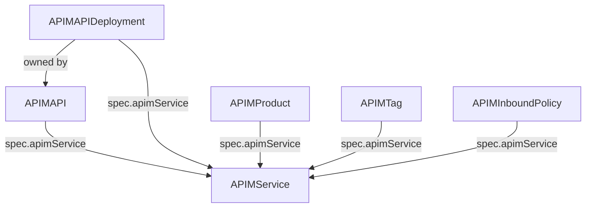

# Custom Resource Definitions

The operator defines six custom resource types in the `apim.operator.io/v1` API group. This document provides a complete reference for each CRD.

## Resource Relationships



All resources reference an `APIMService` to identify which Azure APIM instance to target. `APIMAPI` can optionally select application ReplicaSets via `spec.target.selector`, and `APIMAPIDeployment` is additionally owned by an `APIMAPI` resource.

---

## APIMService

References an Azure API Management service instance. This is the central configuration that all other resources point to.

**Namespace:** Operator namespace (e.g., `azure-apim-operator-system`)

### Spec Fields

| Field | Type | Required | Description |
|-------|------|----------|-------------|
| `name` | string | Yes | Name of the Azure APIM service instance in Azure |
| `resourceGroup` | string | Yes | Azure resource group containing the APIM service |
| `subscription` | string | Yes | Azure subscription ID |

### Status Fields

| Field | Type | Description |
|-------|------|-------------|
| `host` | string | Hostname of the APIM service (e.g., `myapim.azure-api.net`) |

### Example

```yaml
apiVersion: apim.operator.io/v1
kind: APIMService
metadata:
  name: my-apim
  namespace: azure-apim-operator-system
spec:
  name: my-apim-instance
  resourceGroup: rg-apim-prod
  subscription: 00000000-0000-0000-0000-000000000000
```

---

## APIMAPI

Declares an API that should be managed in Azure APIM. The operator uses this as the source of truth for API configuration. When a matching application ReplicaSet becomes ready, the operator reads this resource to determine how to import the API.

**Namespace:** Same namespace as the application Deployment.

**Matching behavior:**

- Preferred: set `spec.target.selector` to match the application's ReplicaSet labels.
- Legacy fallback: if `spec.target.selector` is omitted, `metadata.name` must match the ReplicaSet `app.kubernetes.io/name` label.
- `serviceUrl` and `openApiDefinitionUrl` remain explicit URLs. They often point to an ingress or internal host rather than a Kubernetes Service DNS name.

### Spec Fields

| Field | Type | Required | Default | Description |
|-------|------|----------|---------|-------------|
| `APIID` | string | Yes | | Unique identifier for the API in APIM |
| `apimService` | string | Yes | | Name of the `APIMService` CR to target |
| `routePrefix` | string | Yes | | Base route path in APIM (e.g., `/my-api`) |
| `serviceUrl` | string | Yes | | Backend service URL that APIM proxies to |
| `openApiDefinitionUrl` | string | Yes | | URL to fetch the OpenAPI/Swagger spec |
| `target.selector` | object | No | | Label selector used to match application ReplicaSets |
| `subscriptionRequired` | bool | No | `true` | Whether a subscription key is required |
| `productIds` | []string | No | | Product IDs to associate with this API |
| `tagIds` | []string | No | | Tag IDs to apply to this API |

### Status Fields

| Field | Type | Description |
|-------|------|-------------|
| `importedAt` | string | Timestamp of last successful import (RFC 3339) |
| `status` | string | Current status (`OK` or `Error`) |
| `apiHost` | string | Full APIM gateway URL (e.g., `https://apim.azure-api.net/my-api`) |
| `developerPortalHost` | string | APIM developer portal URL |

### Example

```yaml
apiVersion: apim.operator.io/v1
kind: APIMAPI
metadata:
  name: payment-public
  namespace: integrations
spec:
  APIID: payment-api
  apimService: my-apim
  routePrefix: /payments
  serviceUrl: https://payments.internal.example.com
  openApiDefinitionUrl: https://payments.internal.example.com/swagger/v1/swagger.json
  target:
    selector:
      matchLabels:
        app.kubernetes.io/name: payment-service
  subscriptionRequired: true
  productIds:
    - integrations-product
  tagIds:
    - payments
```

If you omit `target`, the legacy behavior still works: name the `APIMAPI` resource `payment-service` so it matches `app.kubernetes.io/name` on the workload.

---

## APIMAPIDeployment

A transient resource that triggers the API import workflow. Created automatically by the `ReplicaSetWatcher` controller when an application ReplicaSet becomes ready. Deleted automatically after a successful import.

You typically do not create this resource manually. The controller sets `spec.apimApiName` so the deployment can patch status back onto the source `APIMAPI` without relying on implicit name matching.

**Namespace:** Same namespace as the application.

### Spec Fields

| Field | Type | Required | Default | Description |
|-------|------|----------|---------|-------------|
| `APIID` | string | Yes | | Unique identifier for the API in APIM |
| `apimApiName` | string | No | | Source `APIMAPI` name; set automatically by the operator |
| `apimService` | string | Yes | | Name of the `APIMService` CR |
| `subscription` | string | Yes | | Azure subscription ID |
| `resourceGroup` | string | Yes | | Azure resource group |
| `routePrefix` | string | Yes | | Base route path in APIM |
| `serviceUrl` | string | Yes | | Backend service URL |
| `openApiDefinitionUrl` | string | Yes | | URL to fetch the OpenAPI spec |
| `subscriptionRequired` | bool | No | `true` | Whether a subscription key is required |
| `revision` | string | No | | API revision number (creates a new revision if set) |
| `productIds` | []string | No | | Product IDs to assign |
| `tagIds` | []string | No | | Tag IDs to assign |

### Status Fields

| Field | Type | Description |
|-------|------|-------------|
| `importedAt` | string | Timestamp of import |
| `status` | string | Deployment status (`OK` or `Error`) |

### Example

```yaml
apiVersion: apim.operator.io/v1
kind: APIMAPIDeployment
metadata:
  name: payment-public
  namespace: integrations
  ownerReferences:
    - apiVersion: apim.operator.io/v1
      kind: APIMAPI
      name: payment-public
      controller: true
spec:
  APIID: payment-api
  apimApiName: payment-public
  apimService: my-apim
  subscription: 00000000-0000-0000-0000-000000000000
  resourceGroup: rg-apim-prod
  routePrefix: /payments
  serviceUrl: https://payments.internal.example.com
  openApiDefinitionUrl: https://payments.internal.example.com/swagger/v1/swagger.json
  subscriptionRequired: true
  productIds:
    - integrations-product
```

---

## APIMProduct

Manages a product in Azure APIM. Products group APIs and control access through subscriptions.

**Namespace:** Operator namespace.

### Spec Fields

| Field | Type | Required | Description |
|-------|------|----------|-------------|
| `productId` | string | Yes | Unique product identifier in APIM |
| `displayName` | string | Yes | Friendly display name |
| `description` | string | No | Product description |
| `published` | bool | No | Whether the product is published and visible |
| `apimService` | string | Yes | Name of the `APIMService` CR |
| `apiID` | string | No | API to associate with this product |

### Status Fields

| Field | Type | Description |
|-------|------|-------------|
| `phase` | string | Lifecycle state (`Created` or `Error`) |
| `message` | string | Error details or status context |

### Example

```yaml
apiVersion: apim.operator.io/v1
kind: APIMProduct
metadata:
  name: integrations-product
  namespace: azure-apim-operator-system
spec:
  productId: integrations-product
  displayName: Integrations
  description: All integration APIs
  published: true
  apimService: my-apim
```

---

## APIMTag

Manages a tag in Azure APIM. Tags are used for categorization and organization of APIs.

**Namespace:** Operator namespace.

### Spec Fields

| Field | Type | Required | Description |
|-------|------|----------|-------------|
| `tagId` | string | Yes | Unique tag identifier in APIM |
| `displayName` | string | Yes | Display name shown in the APIM UI |
| `apimService` | string | Yes | Name of the `APIMService` CR |

### Status Fields

| Field | Type | Description |
|-------|------|-------------|
| `phase` | string | Lifecycle state (`Created` or `Error`) |
| `message` | string | Error details or status context |

### Example

```yaml
apiVersion: apim.operator.io/v1
kind: APIMTag
metadata:
  name: payments-tag
  namespace: azure-apim-operator-system
spec:
  tagId: payments
  displayName: Payments
  apimService: my-apim
```

---

## APIMInboundPolicy

Manages inbound policies in Azure APIM. Policies can be applied at the API level or at a specific operation level.

**Namespace:** Operator namespace.

### Spec Fields

| Field | Type | Required | Description |
|-------|------|----------|-------------|
| `apimService` | string | Yes | Name of the `APIMService` CR |
| `apiId` | string | Yes | API identifier in APIM |
| `operationId` | string | No | Operation identifier. If set, the policy applies to this specific operation. If omitted, the policy applies to the entire API. |
| `policyContent` | string | Yes | Complete XML policy document |

### Status Fields

| Field | Type | Description |
|-------|------|-------------|
| `phase` | string | Lifecycle state (`Created` or `Error`) |
| `message` | string | Error details or status context |

### Example: API-Level Policy

```yaml
apiVersion: apim.operator.io/v1
kind: APIMInboundPolicy
metadata:
  name: payment-api-policy
  namespace: azure-apim-operator-system
spec:
  apimService: my-apim
  apiId: payment-api
  policyContent: |
    <policies>
      <inbound>
        <base />
        <rate-limit calls="100" renewal-period="60" />
      </inbound>
      <backend>
        <base />
      </backend>
      <outbound>
        <base />
      </outbound>
      <on-error>
        <base />
      </on-error>
    </policies>
```

### Example: Operation-Level Policy

```yaml
apiVersion: apim.operator.io/v1
kind: APIMInboundPolicy
metadata:
  name: upload-payment-policy
  namespace: azure-apim-operator-system
spec:
  apimService: my-apim
  apiId: payment-api
  operationId: UploadPayment_FI_Nordea
  policyContent: |
    <policies>
      <inbound>
        <base />
        <set-header name="X-Custom-Header" exists-action="override">
          <value>custom-value</value>
        </set-header>
      </inbound>
      <backend>
        <base />
      </backend>
      <outbound>
        <base />
      </outbound>
      <on-error>
        <base />
      </on-error>
    </policies>
```

**Note:** The `operationId` value must match the `operationId` in the imported OpenAPI spec. See [OpenAPI Spec Requirements](openapi-spec-requirements.md) for how to set operationId values in your API.
