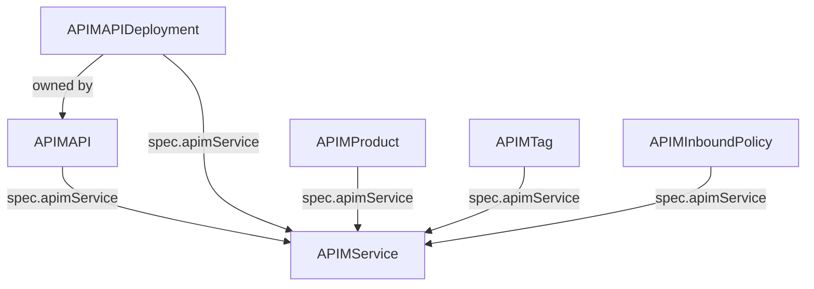

# Custom Resource Definitions

The operator defines six custom resource types in the `apim.operator.io/v1` API group. This document provides a complete reference for each CRD.

## Resource Relationships


```mermaid
flowchart TD
    APIMService["APIMService"]
    APIMAPI["APIMAPI"]
    APIMAPIDeployment["APIMAPIDeployment"]
    APIMProduct["APIMProduct"]
    APIMTag["APIMTag"]
    APIMInboundPolicy["APIMInboundPolicy"]

    APIMAPI -->|spec.apimService| APIMService
    APIMAPIDeployment -->|spec.apimService| APIMService
    APIMProduct -->|spec.apimService| APIMService
    APIMTag -->|spec.apimService| APIMService
    APIMInboundPolicy -->|spec.apimService| APIMService
    APIMAPIDeployment -->|owned by| APIMAPI
```

All resources reference an `APIMService` to identify which Azure APIM instance to target. `APIMAPI` can optionally select application ReplicaSets via `spec.target.selector`, and `APIMAPIDeployment` is additionally owned by an `APIMAPI` resource.

---

## APIMService

References an Azure API Management service instance. This is the central configuration that all other resources point to.

**Namespace:** Operator namespace (e.g., `azure-apim-operator-system`)

### Spec Fields

| Field | Type | Required | Description |
|-------|------|----------|-------------|
| `name` | string | Yes | Name of the Azure APIM service instance in Azure |
| `resourceGroup` | string | Yes | Azure resource group containing the APIM service |
| `subscription` | string | Yes | Azure subscription ID |

### Status Fields

| Field | Type | Description |
|-------|------|-------------|
| `host` | string | Hostname of the APIM service (e.g., `myapim.azure-api.net`) |

### Example

```yaml
apiVersion: apim.operator.io/v1
kind: APIMService
metadata:
  name: my-apim
  namespace: azure-apim-operator-system
spec:
  name: my-apim-instance
  resourceGroup: rg-apim-prod
  subscription: 00000000-0000-0000-0000-000000000000
```

---

## APIMAPI

Declares an API that should be managed in Azure APIM. The operator uses this as the source of truth for API configuration. When a matching application ReplicaSet becomes ready, the operator reads this resource to determine how to import the API.

**Namespace:** Same namespace as the application Deployment.

**Matching behavior:**

- Preferred: set `spec.target.selector` to match the application's ReplicaSet labels.
- Legacy fallback: if `spec.target.selector` is omitted, `metadata.name` must match the ReplicaSet `app.kubernetes.io/name` label.
- `serviceUrl` and `openApiDefinitionUrl` remain explicit URLs. They often point to an ingress or internal host rather than a Kubernetes Service DNS name.

**API types:**

- `http` (default): the operator fetches `openApiDefinitionUrl` and imports it. Operations come from the document.
- `websocket`: no document is fetched. The operator creates a WebSocket API in APIM from `serviceUrl` (`ws://` or `wss://`), `routePrefix` and the optional `websocket` block; APIM adds the single `onHandshake` operation itself. Use this for SignalR hubs and other socket servers, which OpenAPI cannot describe and which APIM will not accept inside an HTTP API. The SignalR `negotiate` call is plain HTTP and belongs in the HTTP API's OpenAPI document instead.

Settings that only apply to one type live in a block named after the type (`websocket:` today), so a field cannot be set where it would be silently ignored. The CRD rejects an `http` API without `openApiDefinitionUrl`, an `http` API with a `ws(s)://` backend, a `websocket` API with an `http(s)://` backend, and a `websocket` block on anything but a `websocket` API.

### Spec Fields

| Field | Type | Required | Default | Description |
|-------|------|----------|---------|-------------|
| `APIID` | string | Yes | | Unique identifier for the API in APIM |
| `apimService` | string | Yes | | Name of the `APIMService` CR to target |
| `deletionPolicy` | string | No | `Retain` | `Retain` leaves the API in APIM when this resource is deleted. `Delete` is declared for a uniform contract but not implemented for APIs yet |
| `type` | string | No | `http` | `http` or `websocket` |
| `routePrefix` | string | Yes | | Base route path in APIM (e.g., `/my-api`) |
| `serviceUrl` | string | Yes | | Backend URL that APIM proxies to; `http(s)://` for `http`, `ws(s)://` for `websocket` |
| `openApiDefinitionUrl` | string | For `http` | | URL to fetch the OpenAPI/Swagger spec; ignored for `websocket` |
| `websocket` | object | No | | Websocket-only settings; only allowed when `type` is `websocket` |
| `websocket.displayName` | string | No | `APIID` | Display name in APIM (HTTP APIs take `info.title` from the document) |
| `websocket.protocols` | []string | No | `[wss]` | Gateway protocols, `ws` and/or `wss` |
| `target.selector` | object | No | | Label selector used to match application ReplicaSets |
| `subscriptionRequired` | bool | No | `true` | Whether a subscription key is required |
| `productIds` | []string | No | | Product IDs to associate with this API |
| `tagIds` | []string | No | | Tag IDs to apply to this API |

### Status Fields

| Field | Type | Description |
|-------|------|-------------|
| `importedAt` | string | Timestamp of last successful import (RFC 3339) |
| `status` | string | `OK` once the API is written to APIM (or found in sync); `Error` when its `APIMAPIDeployment` is `Stalled` or `Invalid`. A deployment that is only backing off leaves it unchanged |
| `apiHost` | string | Full APIM gateway URL (e.g., `https://apim.azure-api.net/my-api`; `wss://` for websocket APIs) |
| `developerPortalHost` | string | APIM developer portal URL |

### Example

```yaml
apiVersion: apim.operator.io/v1
kind: APIMAPI
metadata:
  name: payment-public
  namespace: integrations
spec:
  APIID: payment-api
  apimService: my-apim
  routePrefix: /payments
  serviceUrl: https://payments.internal.example.com
  openApiDefinitionUrl: https://payments.internal.example.com/swagger/v1/swagger.json
  target:
    selector:
      matchLabels:
        app.kubernetes.io/name: payment-service
  subscriptionRequired: true
  productIds:
    - integrations-product
  tagIds:
    - payments
```

If you omit `target`, the legacy behavior still works: name the `APIMAPI` resource `payment-service` so it matches `app.kubernetes.io/name` on the workload.

### WebSocket Example

```yaml
apiVersion: apim.operator.io/v1
kind: APIMAPI
metadata:
  name: bidme-signalr-connect
  namespace: retail-bidme-prod
spec:
  APIID: distribution-bidme-signalr-connect
  type: websocket
  websocket:
    displayName: Distribution - BidMe - SignalR connect
  apimService: apim-apim-prod-hedinit
  routePrefix: /bidme/auctionhub
  serviceUrl: wss://bidme.retail-prod.external.hedinit.io/auctionhub
  target:
    selector:
      matchLabels:
        app.kubernetes.io/name: bidme
  subscriptionRequired: true
  productIds:
    - distribution-bidme
```

---

## APIMAPIDeployment

Carries one `APIMAPI` into APIM and holds the state of that import. The operator creates it with the same name as the `APIMAPI`, owned by it, and copies the `APIMAPI` spec onto it whenever the `APIMAPI` changes. It is not deleted after an import; it goes away with its `APIMAPI`. The ReplicaSet watcher annotates it when a matching workload becomes ready, which makes the operator reconcile it.

You do not create or edit this resource yourself, except for the `apim.operator.io/retry` annotation (see [Retries and recovery](troubleshooting.md#retries-and-recovery)). The controller sets `spec.apimApiName` so the deployment can patch status back onto the source `APIMAPI` without relying on implicit name matching.

**Namespace:** Same namespace as the application.

### Spec Fields

| Field | Type | Required | Default | Description |
|-------|------|----------|---------|-------------|
| `APIID` | string | Yes | | Unique identifier for the API in APIM |
| `apimApiName` | string | No | | Source `APIMAPI` name; set automatically by the operator |
| `apimService` | string | Yes | | Name of the `APIMService` CR |
| `subscription` | string | Yes | | Azure subscription ID |
| `resourceGroup` | string | Yes | | Azure resource group |
| `type` | string | No | `http` | `http` or `websocket`; copied from the `APIMAPI` |
| `websocket` | object | No | | Websocket-only settings; copied from the `APIMAPI` |
| `routePrefix` | string | Yes | | Base route path in APIM |
| `serviceUrl` | string | Yes | | Backend service URL |
| `openApiDefinitionUrl` | string | For `http` | | URL to fetch the OpenAPI spec; empty for websocket APIs |
| `subscriptionRequired` | bool | No | `true` | Whether a subscription key is required |
| `revision` | string | No | | API revision number (creates a new revision if set) |
| `productIds` | []string | No | | Product IDs to assign |
| `tagIds` | []string | No | | Tag IDs to assign |

### Status Fields

| Field | Type | Description |
|-------|------|-------------|
| `phase` | string | `WaitingForMatch`, `WaitingForReadyPod`, `WaitingForRollout`, `Importing`, `Succeeded`, `Error`, `Backoff`, `Stalled` or `Invalid` (see below) |
| `status` | string | `OK`, `Pending` or `Error` |
| `message` | string | What the operator is doing or why it stopped |
| `lastError` | string | The most recent error, if any |
| `lastAttemptAt` | string | Time of the most recent reconcile attempt (RFC 3339) |
| `observedGeneration` | int | The `APIMAPI` generation this status reflects |
| `matchedReplicaSets` | []string | ReplicaSets currently matched to the `APIMAPI` |
| `openApiHash` | string | Hash of the last fetched OpenAPI document |
| `desiredHash` | string | Hash of the desired APIM state (spec, APIM location, document) |
| `appliedHash` | string | Desired hash last fully applied in APIM. When it equals the desired hash, nothing is written |
| `importedHash` | string | Desired hash the API itself was last written for. While it equals the desired hash, a failed product, tag or host step is retried without importing again |
| `importedAt` | string | Time of the last successful reconcile in APIM |
| `pendingImport` | object | An import APIM accepted (`202`) and is still running: `operationUrl`, `desiredHash`, `startedAt`. While it is set the operator reads the operation instead of writing the API again |
| `consecutiveFailures` | int | Failed APIM writes in a row since the last success, spec change or retry annotation |
| `nextAttemptAt` | string | Earliest time of the next APIM write while backing off (RFC 3339); empty otherwise |
| `lastRetryAnnotation` | string | The `apim.operator.io/retry` value the operator last acted on |

| Phase | Meaning |
|-------|---------|
| `WaitingForMatch` | No ReplicaSet matches the `APIMAPI`; rechecked every 2 minutes |
| `WaitingForReadyPod` | Matching ReplicaSets have no ready pod yet; rechecked every 2 minutes |
| `WaitingForRollout` | An older revision still has ready pods; rechecked every 30 seconds |
| `Importing` | Writing to APIM, or waiting for an import APIM accepted (`pendingImport`) |
| `Succeeded` | APIM holds the desired state |
| `Error` | A step before the APIM write failed (missing `APIMService`, fetch, identity, token); retried after 30 or 60 seconds |
| `Backoff` | An APIM write failed; the next one waits until `nextAttemptAt` |
| `Stalled` | Five transient failures in a row; no more writes until reset |
| `Invalid` | APIM rejected the request; no more writes until reset |

### Example

```yaml
apiVersion: apim.operator.io/v1
kind: APIMAPIDeployment
metadata:
  name: payment-public
  namespace: integrations
  ownerReferences:
    - apiVersion: apim.operator.io/v1
      kind: APIMAPI
      name: payment-public
      controller: true
spec:
  APIID: payment-api
  apimApiName: payment-public
  apimService: my-apim
  subscription: 00000000-0000-0000-0000-000000000000
  resourceGroup: rg-apim-prod
  routePrefix: /payments
  serviceUrl: https://payments.internal.example.com
  openApiDefinitionUrl: https://payments.internal.example.com/swagger/v1/swagger.json
  subscriptionRequired: true
  productIds:
    - integrations-product
```

---

## APIMProduct

Manages a product in Azure APIM. Products group APIs and control access through subscriptions.

**Namespace:** Operator namespace.

### Spec Fields

| Field | Type | Required | Description |
|-------|------|----------|-------------|
| `productId` | string | Yes | Unique product identifier in APIM |
| `displayName` | string | Yes | Friendly display name |
| `description` | string | No | Product description |
| `published` | bool | No | Whether the product is published and visible |
| `apimService` | string | Yes | Name of the `APIMService` CR |
| `deletionPolicy` | string | No | `Retain` (default) leaves the product in APIM when this resource is deleted. `Delete` removes it from APIM first, subscriptions included, via a finalizer |
| `apiID` | string | No | Ignored: the operator does not read it. Assign APIs to a product with `productIds` on the `APIMAPI` |

### Status Fields

| Field | Type | Description |
|-------|------|-------------|
| `phase` | string | `Created`, `Error`, `Backoff`, `Stalled` or `Invalid` (see [Retry status](#retry-status)) |
| `message` | string | Status context; on a failed write, the step, the APIM error and what happens next |
| `observedGeneration` | int | The `metadata.generation` the last APIM write was for |
| `consecutiveFailures` | int | Failed APIM writes in a row |
| `nextAttemptAt` | string | Earliest time of the next APIM write while backing off |
| `lastRetryAnnotation` | string | The `apim.operator.io/retry` value the operator last acted on |

### Example

```yaml
apiVersion: apim.operator.io/v1
kind: APIMProduct
metadata:
  name: integrations-product
  namespace: azure-apim-operator-system
spec:
  productId: integrations-product
  displayName: Integrations
  description: All integration APIs
  published: true
  apimService: my-apim
  # Retain (default) keeps the product in APIM when this resource is deleted.
  # Delete removes it - and its subscriptions - from APIM first.
  deletionPolicy: Retain
```

---

## APIMTag

Manages a tag in Azure APIM. Tags are used for categorization and organization of APIs.

**Namespace:** Operator namespace.

### Spec Fields

| Field | Type | Required | Description |
|-------|------|----------|-------------|
| `tagId` | string | Yes | Unique tag identifier in APIM |
| `displayName` | string | Yes | Display name shown in the APIM UI |
| `apimService` | string | Yes | Name of the `APIMService` CR |
| `deletionPolicy` | string | No | `Retain` (default) leaves the tag in APIM. `Delete` is declared but not implemented for tags yet |

### Status Fields

| Field | Type | Description |
|-------|------|-------------|
| `phase` | string | `Created`, `Error`, `Backoff`, `Stalled` or `Invalid` (see [Retry status](#retry-status)) |
| `message` | string | Status context; on a failed write, the step, the APIM error and what happens next |
| `observedGeneration` | int | The `metadata.generation` the last APIM write was for |
| `consecutiveFailures` | int | Failed APIM writes in a row |
| `nextAttemptAt` | string | Earliest time of the next APIM write while backing off |
| `lastRetryAnnotation` | string | The `apim.operator.io/retry` value the operator last acted on |

### Example

```yaml
apiVersion: apim.operator.io/v1
kind: APIMTag
metadata:
  name: payments-tag
  namespace: azure-apim-operator-system
spec:
  tagId: payments
  displayName: Payments
  apimService: my-apim
```

---

## APIMInboundPolicy

Manages inbound policies in Azure APIM. Policies can be applied at the API level or at a specific operation level.

**Namespace:** Operator namespace.

### Spec Fields

| Field | Type | Required | Description |
|-------|------|----------|-------------|
| `apimService` | string | Yes | Name of the `APIMService` CR |
| `deletionPolicy` | string | No | `Retain` (default) leaves the policy in APIM. `Delete` is declared but not implemented for policies yet |
| `apiId` | string | Yes | API identifier in APIM |
| `operationId` | string | No | Operation identifier. If set, the policy applies to this specific operation. If omitted, the policy applies to the entire API. |
| `policyContent` | string | Yes | Complete XML policy document |

### Status Fields

| Field | Type | Description |
|-------|------|-------------|
| `phase` | string | `Created`, `Error`, `Backoff`, `Stalled` or `Invalid` (see [Retry status](#retry-status)) |
| `message` | string | Status context; on a failed write, the step, the APIM error and what happens next |
| `observedGeneration` | int | The `metadata.generation` the last APIM write was for |
| `consecutiveFailures` | int | Failed APIM writes in a row |
| `nextAttemptAt` | string | Earliest time of the next APIM write while backing off |
| `lastRetryAnnotation` | string | The `apim.operator.io/retry` value the operator last acted on |

### Example: API-Level Policy

```yaml
apiVersion: apim.operator.io/v1
kind: APIMInboundPolicy
metadata:
  name: payment-api-policy
  namespace: azure-apim-operator-system
spec:
  apimService: my-apim
  apiId: payment-api
  policyContent: |
    <policies>
      <inbound>
        <base />
        <rate-limit calls="100" renewal-period="60" />
      </inbound>
      <backend>
        <base />
      </backend>
      <outbound>
        <base />
      </outbound>
      <on-error>
        <base />
      </on-error>
    </policies>
```

### Example: Operation-Level Policy

```yaml
apiVersion: apim.operator.io/v1
kind: APIMInboundPolicy
metadata:
  name: upload-payment-policy
  namespace: azure-apim-operator-system
spec:
  apimService: my-apim
  apiId: payment-api
  operationId: UploadPayment_FI_Nordea
  policyContent: |
    <policies>
      <inbound>
        <base />
        <set-header name="X-Custom-Header" exists-action="override">
          <value>custom-value</value>
        </set-header>
      </inbound>
      <backend>
        <base />
      </backend>
      <outbound>
        <base />
      </outbound>
      <on-error>
        <base />
      </on-error>
    </policies>
```

**Note:** The `operationId` value must match the `operationId` in the imported OpenAPI spec. See [OpenAPI Spec Requirements](openapi-spec-requirements.md) for how to set operationId values in your API.

## Retry status

`APIMAPIDeployment`, `APIMProduct`, `APIMTag` and `APIMInboundPolicy` write to APIM and share one retry policy:

| Phase | Meaning |
|-------|---------|
| `Backoff` | A write failed; the next one waits until `status.nextAttemptAt` (1, 2, 4, 8 minutes, +/-20 %, capped at 30 minutes) |
| `Stalled` | Five transient failures in a row; no more writes until reset |
| `Invalid` | APIM rejected the request (400, 401, 403, 404 on the resource's own path, a document APIM refused); no more writes until reset. A 403 with the Azure code `AuthorizationFailed` counts as transient |
| `Error` | A step before the write failed (missing `APIMService`, missing identity, token); retried after 30 or 60 seconds, not counted |

A write that fails only because something it depends on is not in APIM yet (the product or tag of an assignment, the API of a policy) keeps backing off, at most 30 minutes apart, and never becomes `Stalled`.

To reset a `Stalled` or `Invalid` resource, change its spec or set the `apim.operator.io/retry` annotation to a new value. For an API, annotate the `APIMAPIDeployment` (same name as the `APIMAPI`):

```bash
kubectl annotate apimapideployment <name> -n <namespace> apim.operator.io/retry="$(date +%s)" --overwrite
```

See [Troubleshooting: Retries and recovery](troubleshooting.md#retries-and-recovery).

## Field validation

Every identifier, name and URL in these resources is validated by the CRD
schema, and the operator percent-escapes each one again when it builds an Azure
Resource Manager URL. Before 0.28.0 the only validation marker in the API
package was a single default, and ids were interpolated into ARM paths with
`fmt.Sprintf`, so a value containing `/`, `?`, `#` or `..` changed which
resource a request targeted (APIM-16).

| Field | Rule |
|-------|------|
| `APIID`, `apiId`, `apiID`, `productId`, `tagId`, `operationId` | 1-80 chars, starts and ends alphanumeric, otherwise letters, digits, `.`, `_`, `-` |
| `apimService`, `name` | 1-50 chars, starts and ends alphanumeric, otherwise letters, digits, `-` |
| `subscription` | a GUID |
| `resourceGroup` | 1-90 chars, Azure resource-group characters |
| `serviceUrl`, `openApiDefinitionUrl` | must start `http://` or `https://`, max 2048 chars |
| `routePrefix` | letters, digits, `.`, `_`, `~`, `/`, `-`; max 400 chars |
| `revision` | digits only |
| `displayName` | 1-300 chars |
| `policyContent` | 1-131072 chars |

A rejected resource fails at `kubectl apply` or at ArgoCD sync time with the
pattern in the message, rather than reaching Azure.
